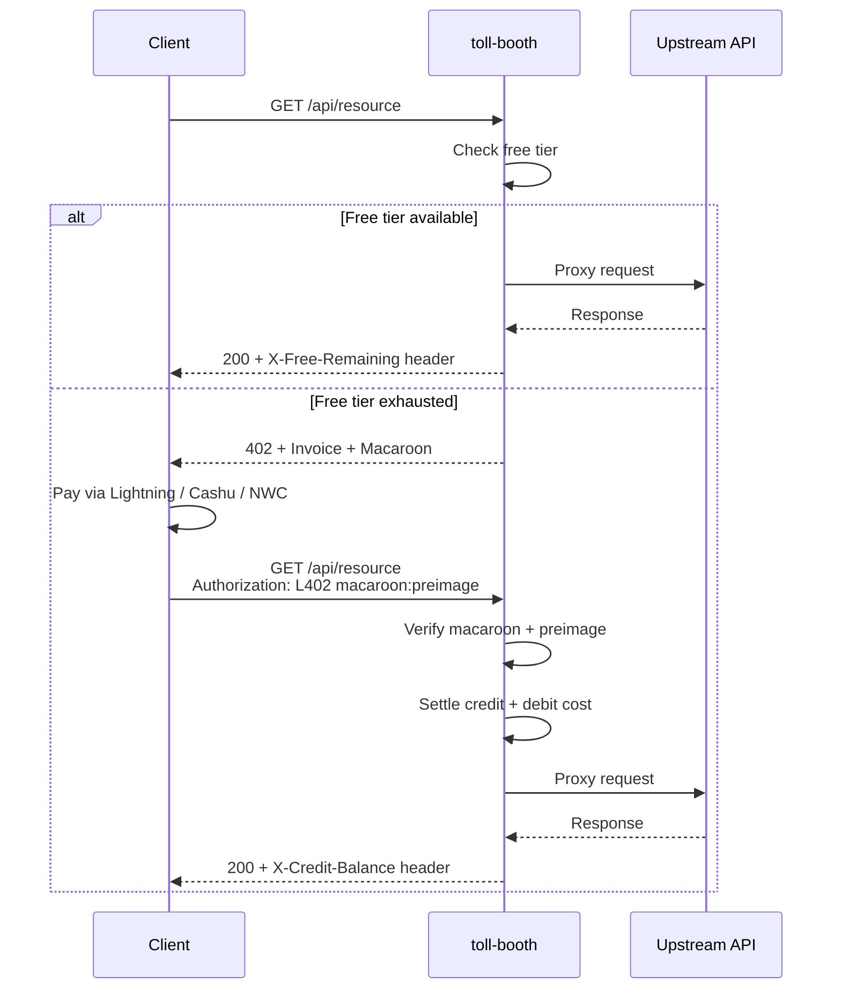

# toll-booth

[](./LICENSE)
[](https://primal.net/p/npub1mgvlrnf5hm9yf0n5mf9nqmvarhvxkc6remu5ec3vf8r0txqkuk7su0e7q2)

**Any API becomes a Lightning toll booth in one line.**


[Live demo](https://jokes.trotters.dev/api/joke) - pay 10 sats, get a joke. No account. No sign-up.

### Try it now

```bash
npx @thecryptodonkey/toll-booth demo
```

Spins up a fully working L402-gated joke API on localhost. Mock Lightning backend, in-memory storage, zero configuration. Scan the QR code from your terminal when the free tier runs out.

---

## Minimal example

```typescript
import express from 'express'
import { Booth } from '@thecryptodonkey/toll-booth'
import { phoenixdBackend } from '@thecryptodonkey/toll-booth/backends/phoenixd'

const app = express()
const booth = new Booth({
  adapter: 'express',
  backend: phoenixdBackend({ url: 'http://localhost:9740', password: process.env.PHOENIXD_PASSWORD! }),
  pricing: { '/api': 10 },           // 10 sats per request
  upstream: 'http://localhost:8080',  // your existing API
})

app.get('/invoice-status/:paymentHash', booth.invoiceStatusHandler as express.RequestHandler)
app.post('/create-invoice', booth.createInvoiceHandler as express.RequestHandler)
app.use('/', booth.middleware as express.RequestHandler)

app.listen(3000)
```

---

## The old way vs toll-booth

| | The old way | With toll-booth |
|---|---|---|
| **Step 1** | Create a Stripe account | `npm install @thecryptodonkey/toll-booth` |
| **Step 2** | Verify your identity (KYC) | Set your pricing: `{ '/api': 10 }` |
| **Step 3** | Integrate billing SDK | `app.use(booth.middleware)` |
| **Step 4** | Build a sign-up page | Done. No sign-up page needed. |
| **Step 5** | Handle webhooks, refunds, chargebacks | Done. Payments are final. |

---

## Five zeroes

Zero accounts. Zero API keys. Zero chargebacks. Zero KYC. Zero vendor lock-in.

Your API earns sats the moment it receives a request. Clients pay with any Lightning wallet, no relationship with you required. Payments settle instantly and are cryptographically final - no disputes, no reversals, no Stripe risk reviews.

---

## Let AI agents pay for your API with Lightning

toll-booth is the **server side** of a two-part stack for machine-to-machine payments.
[l402-mcp](https://github.com/TheCryptoDonkey/l402-mcp) is the **client side** - an MCP server that gives AI agents the ability to discover, pay, and consume L402-gated APIs autonomously.

```
AI Agent -> l402-mcp -> toll-booth -> Your API
```

An agent using Claude, GPT, or any MCP-capable model can call your API, receive a 402 payment challenge, pay the Lightning invoice from its wallet, and retry - all without human intervention. No OAuth dance, no API key rotation, no billing portal.

---

## Live demo

```bash
# Get a free joke (1 free per day per IP)
curl https://jokes.trotters.dev/api/joke

# Free tier exhausted - request a Lightning invoice for 10 sats
curl -X POST https://jokes.trotters.dev/create-invoice

# Pay the invoice with any Lightning wallet, then authenticate
curl -H "Authorization: L402 <macaroon>:<preimage>" https://jokes.trotters.dev/api/joke
```

---

## Features

- **L402 protocol** - industry-standard HTTP 402 payment flow with macaroon credentials
- **Multiple Lightning backends** - Phoenixd, LND, CLN, LNbits, Alby
- **Alternative payment methods** - Nostr Wallet Connect (NWC) and Cashu ecash tokens
- **Cashu-only mode** - no Lightning node required; ideal for serverless and edge deployments
- **Credit system** - pre-paid balance with volume discount tiers
- **Free tier** - configurable daily allowance per IP
- **Self-service payment page** - QR codes, tier selector, wallet adapter buttons
- **SQLite persistence** - WAL mode, automatic invoice expiry pruning
- **Framework-agnostic core** - use the `Booth` facade or wire handlers directly

---

## Quick start

```bash
npm install @thecryptodonkey/toll-booth
```

### Express

```typescript
import express from 'express'
import { Booth } from '@thecryptodonkey/toll-booth'
import { phoenixdBackend } from '@thecryptodonkey/toll-booth/backends/phoenixd'

const app = express()
app.use(express.json())

const booth = new Booth({
  adapter: 'express',
  backend: phoenixdBackend({
    url: 'http://localhost:9740',
    password: process.env.PHOENIXD_PASSWORD!,
  }),
  pricing: { '/api': 10 },           // 10 sats per request
  upstream: 'http://localhost:8080',  // your API
  rootKey: process.env.ROOT_KEY,      // 64 hex chars, required for production
})

app.get('/invoice-status/:paymentHash', booth.invoiceStatusHandler as express.RequestHandler)
app.post('/create-invoice', booth.createInvoiceHandler as express.RequestHandler)
app.use('/', booth.middleware as express.RequestHandler)

app.listen(3000)
```

### Web Standard (Deno / Bun / Workers)

```typescript
import { Booth } from '@thecryptodonkey/toll-booth'
import { lndBackend } from '@thecryptodonkey/toll-booth/backends/lnd'

const booth = new Booth({
  adapter: 'web-standard',
  backend: lndBackend({
    url: 'https://localhost:8080',
    macaroon: process.env.LND_MACAROON!,
  }),
  pricing: { '/api': 5 },
  upstream: 'http://localhost:8080',
})

// Deno example
Deno.serve({ port: 3000 }, async (req: Request) => {
  const url = new URL(req.url)
  if (url.pathname.startsWith('/invoice-status/'))
    return booth.invoiceStatusHandler(req)
  if (url.pathname === '/create-invoice' && req.method === 'POST')
    return booth.createInvoiceHandler(req)
  return booth.middleware(req)
})
```

### Cashu-only (no Lightning node)

```typescript
import { Booth } from '@thecryptodonkey/toll-booth'

const booth = new Booth({
  adapter: 'web-standard',
  redeemCashu: async (token, paymentHash) => {
    // Verify and redeem the ecash token with your Cashu mint
    // Return the amount redeemed in satoshis
    return amountRedeemed
  },
  pricing: { '/api': 5 },
  upstream: 'http://localhost:8080',
})
```

No Lightning node, no channels, no liquidity management. Ideal for serverless and edge deployments.

---

## Lightning backends

```typescript
import { phoenixdBackend } from '@thecryptodonkey/toll-booth/backends/phoenixd'
import { lndBackend } from '@thecryptodonkey/toll-booth/backends/lnd'
import { clnBackend } from '@thecryptodonkey/toll-booth/backends/cln'
import { lnbitsBackend } from '@thecryptodonkey/toll-booth/backends/lnbits'
import { albyBackend } from '@thecryptodonkey/toll-booth/backends/alby'
```

Each backend implements the `LightningBackend` interface (`createInvoice` + `checkInvoice`).

| Backend | Status | Notes |
|---------|--------|-------|
| Phoenixd | Stable | Simplest self-hosted option |
| LND | Stable | Industry standard |
| CLN | Stable | Core Lightning REST API |
| LNbits | Stable | Any LNbits instance - self-hosted or hosted |
| Alby (NWC) | Experimental | JSON relay transport is unauthenticated; only enable with `allowInsecureRelay: true` for local testing or a fully trusted relay |

---

## Why not Aperture?

[Aperture](https://github.com/lightninglabs/aperture) is Lightning Labs' production L402 reverse proxy. It's battle-tested and feature-rich. Use it if you can.

| | Aperture | toll-booth |
|---|---|---|
| **Language** | Go binary | TypeScript middleware |
| **Deployment** | Standalone reverse proxy | Embeds in your app, or runs as a gateway in front of any HTTP service |
| **Lightning node** | Requires LND | Phoenixd, LND, CLN, LNbits, or none (Cashu-only) |
| **Serverless** | No - long-running process | Yes - Web Standard adapter runs on Cloudflare Workers, Deno, Bun |
| **Configuration** | YAML file | Programmatic (code) |

---

## Why not x402?

[x402](https://x402.org) is Coinbase's HTTP 402 payment protocol for on-chain stablecoins. It validates the same idea - machines paying for APIs - but makes different trade-offs.

| | x402 | toll-booth |
|---|---|---|
| **Settlement** | On-chain (Base, Ethereum) | Lightning Network - sub-second, final |
| **Settlement time** | Block confirmations (seconds to minutes) | Milliseconds |
| **Transaction fees** | Gas fees (variable) | Routing fees (fractions of a sat) |
| **Currency** | USDC on Base | Bitcoin (sats), with stablecoin compatibility via USDT-over-LN bridges |
| **Infrastructure** | Requires Coinbase Commerce or on-chain wallet | Any of 5 Lightning backends, Cashu ecash, or NWC - self-hosted or hosted |
| **Vendor lock-in** | Coinbase ecosystem | None - open protocol, open source, any Lightning wallet |
| **Serverless** | Yes | Yes - Web Standard adapter for Workers, Deno, Bun |
| **Offline/edge** | No - requires chain access | Yes - Cashu-only mode needs no node at all |

x402 is doing valuable work normalising HTTP 402 as a payment primitive. If your clients already hold USDC on Base, it's a reasonable choice. If you want sub-second settlement, self-sovereign infrastructure, and a protocol that works with any Lightning wallet on earth, toll-booth is the answer.

**Stablecoin compatibility:** toll-booth doesn't care how an invoice gets paid. As USDT-over-Lightning bridges (UTEXO and others) go live, your gated APIs automatically accept stablecoins with zero code changes. The best of both worlds: stablecoin UX on Bitcoin rails.

---

## Using toll-booth with any API

toll-booth works as a **reverse proxy gateway**, so the upstream API can be written in any language - C#, Go, Python, Ruby, Java, or anything else that speaks HTTP. The upstream service doesn't need to know about L402 or Lightning; it just receives normal requests.

```
Client ---> toll-booth (Node.js) ---> Your API (any language)
                |                          |
          L402 payment gating        Plain HTTP requests
          Macaroon verification      X-Credit-Balance header added
```

Point `upstream` at your existing service:

```typescript
const booth = new Booth({
  adapter: 'express',
  backend: phoenixdBackend({ url: '...', password: '...' }),
  pricing: { '/api/search': 5, '/api/generate': 20 },
  upstream: 'http://my-dotnet-api:5000',  // ASP.NET, FastAPI, Gin, Rails...
})
```

Deploy toll-booth as a sidecar (Docker Compose, Kubernetes) or as a standalone gateway in front of multiple services. See [`examples/valhalla-proxy/`](examples/valhalla-proxy/) for a complete Docker Compose reference - the Valhalla routing engine it gates is a C++ service.

---

## Production checklist

- Set a persistent `rootKey` (64 hex chars / 32 bytes), otherwise tokens are invalidated on restart.
- Use a persistent `dbPath` (default: `./toll-booth.db`).
- Enable `strictPricing: true` to prevent unpriced routes from bypassing billing.
- Ensure your `pricing` keys match the paths the middleware actually sees (after mounting).
- Set `trustProxy: true` when behind a reverse proxy, or provide a `getClientIp` callback for per-client free-tier isolation.
- If you implement `redeemCashu`, make it idempotent for the same `paymentHash` - crash recovery depends on it.
- Rate-limit `/create-invoice` at your reverse proxy - each call creates a real Lightning invoice.

---

## Example deployments

### sats-for-laughs - build your own paid API

[`examples/sats-for-laughs/`](examples/sats-for-laughs/) is the fastest path from "I have an API" to "my API earns sats". It's the same code that runs the [live demo](https://jokes.trotters.dev/api/joke). Clone it, change three env vars, deploy.

```bash
cd examples/sats-for-laughs
cp .env.example .env          # add your Phoenixd credentials
docker compose up -d          # or: MOCK=true npm start
```

Includes mock mode for local development (auto-settles invoices, no Lightning node needed), Docker Compose with Phoenixd, and a pre-generated pool of 100+ jokes across six topics.

### valhalla-proxy - production reference

[`examples/valhalla-proxy/`](examples/valhalla-proxy/) gates the [Valhalla](https://github.com/valhalla/valhalla) routing engine (a C++ service) behind Lightning payments. Full Docker Compose setup demonstrating toll-booth as a sidecar proxy in front of non-JavaScript infrastructure.

---

## Payment flow



1. Client requests a priced endpoint without credentials
2. Free tier checked - if allowance remains, request passes through
3. If exhausted - **402** response with BOLT-11 invoice + macaroon
4. Client pays via Lightning, NWC, or Cashu
5. Client sends `Authorization: L402 <macaroon>:<preimage>`
6. Macaroon verified, credit deducted, request proxied upstream

---

## Configuration

The five most common options:

| Option | Type | Description |
|--------|------|-------------|
| `adapter` | `'express' \| 'web-standard'` | Framework integration to use |
| `backend` | `LightningBackend` | Lightning node (optional if using Cashu-only) |
| `pricing` | `Record<string, number>` | Route pattern to cost in sats |
| `upstream` | `string` | URL to proxy authorised requests to |
| `freeTier` | `{ requestsPerDay: number }` | Daily free allowance per IP |

See [docs/configuration.md](docs/configuration.md) for the full reference including `rootKey`, `creditTiers`, `trustProxy`, `nwcPayInvoice`, `redeemCashu`, and all other options.

---

## Vision

**[Why L402?](docs/vision.md)** - the case for permissionless, machine-to-machine payments on the web.

---

## Support

If you find toll-booth useful, consider sending a tip:

- **Lightning:** `thedonkey@strike.me`
- **Nostr zaps:** `npub1mgvlrnf5hm9yf0n5mf9nqmvarhvxkc6remu5ec3vf8r0txqkuk7su0e7q2`

## Licence

[MIT](LICENSE)
