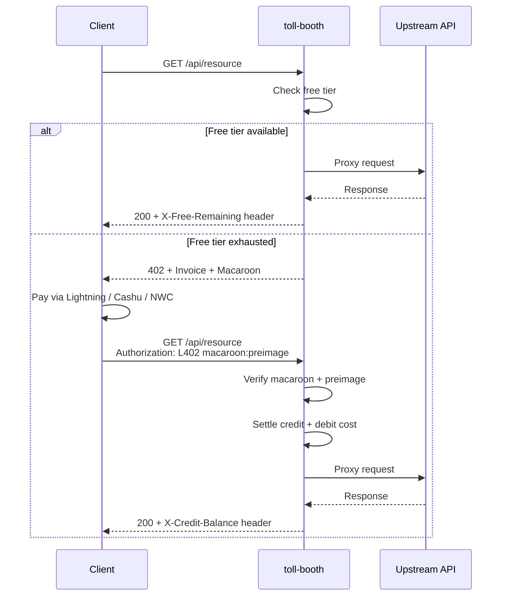

# toll-booth

**Nostr:** [`npub1mgvlrnf5hm9yf0n5mf9nqmvarhvxkc6remu5ec3vf8r0txqkuk7su0e7q2`](https://njump.me/npub1mgvlrnf5hm9yf0n5mf9nqmvarhvxkc6remu5ec3vf8r0txqkuk7su0e7q2)

[](https://github.com/forgesworn/toll-booth/actions/workflows/ci.yml)
[](./LICENSE)
[](https://primal.net/p/npub1mgvlrnf5hm9yf0n5mf9nqmvarhvxkc6remu5ec3vf8r0txqkuk7su0e7q2)
[](https://www.npmjs.com/package/@forgesworn/toll-booth)
[](https://www.typescriptlang.org/)
[](https://nodejs.org/)

**Monetise any API with one line of code.**


[Live demo](https://jokes.trotters.dev/) - pay 21 sats, get a joke. No account. No sign-up. ([API](https://jokes.trotters.dev/api/joke))

### Try it now

```bash
npx @forgesworn/toll-booth demo
```

Spins up a fully working L402-gated joke API on localhost. Mock Lightning backend, in-memory storage, zero configuration. Scan the QR code from your terminal when the free tier runs out.

---

## Minimal example

```typescript
import express from 'express'
import { Booth } from '@forgesworn/toll-booth'
import { phoenixdBackend } from '@forgesworn/toll-booth/backends/phoenixd'

const app = express()
const booth = new Booth({
  adapter: 'express',
  backend: phoenixdBackend({ url: 'http://localhost:9740', password: process.env.PHOENIXD_PASSWORD! }),
  pricing: { '/api': 10 },           // 10 sats per request
  upstream: 'http://localhost:8080',  // your existing API
})

app.get('/invoice-status/:paymentHash', booth.invoiceStatusHandler as express.RequestHandler)
app.post('/create-invoice', booth.createInvoiceHandler as express.RequestHandler)
app.use('/', booth.middleware as express.RequestHandler)

app.listen(3000)
```

---

## The old way vs toll-booth

| | The old way | With toll-booth |
|---|---|---|
| **Step 1** | Create a Stripe account | `npm install @forgesworn/toll-booth` |
| **Step 2** | Verify your identity (KYC) | Set your pricing: `{ '/api': 10 }` |
| **Step 3** | Integrate billing SDK | `app.use(booth.middleware)` |
| **Step 4** | Build a sign-up page | Done. No sign-up page needed. |
| **Step 5** | Handle webhooks, refunds, chargebacks | Done. Payments are final. |

---

## Five zeroes

Zero accounts. Zero API keys. Zero chargebacks. Zero KYC. Zero vendor lock-in.

Your API earns money the moment it receives a request. Clients pay with Lightning, Cashu ecash, or NWC — no relationship with you required. Payments settle instantly and are cryptographically final — no disputes, no reversals, no Stripe risk reviews.

---

## See it in production

[**satgate**](https://github.com/TheCryptoDonkey/satgate) is a pay-per-token AI inference proxy built on toll-booth. It monetises any OpenAI-compatible endpoint — Ollama, vLLM, llama.cpp — with one command. Token counting, model pricing, streaming reconciliation, capacity management. Everything else — payments, credits, free tier, macaroon auth — is toll-booth.

~400 lines of product logic on top of the middleware. That's what "monetise any API with one line of code" looks like in practice.

---

## Let AI agents pay for your API

toll-booth is the **server side** of a two-part stack for machine-to-machine payments.
[402-mcp](https://github.com/forgesworn/402-mcp) is the **client side** - an MCP server that gives AI agents the ability to discover, pay, and consume L402-gated APIs autonomously.

```
AI Agent -> 402-mcp -> toll-booth -> Your API
```

An agent using Claude, GPT, or any MCP-capable model can call your API, receive a 402 payment challenge, pay the Lightning invoice from its wallet, and retry - all without human intervention. No OAuth dance, no API key rotation, no billing portal.

---

## Live demo

Visit [jokes.trotters.dev](https://jokes.trotters.dev/) in a browser to try it - get a free joke, hit the paywall, scan the QR code or pay with a browser wallet extension.

Or use the API directly:

```bash
# Get a free joke (1 free per day per IP)
curl https://jokes.trotters.dev/api/joke

# Free tier exhausted - request a Lightning invoice for 21 sats
curl -X POST https://jokes.trotters.dev/create-invoice

# Pay the invoice with any Lightning wallet, then authenticate
curl -H "Authorization: L402 <macaroon>:<preimage>" https://jokes.trotters.dev/api/joke
```

---

## Features

- **L402 protocol** - industry-standard HTTP 402 payment flow with macaroon credentials
- **Multiple Lightning backends** - Phoenixd, LND, CLN, LNbits, NWC (any Nostr Wallet Connect wallet)
- **Alternative payment methods** - Cashu ecash tokens and xcashu (NUT-24) direct-header payments
- **IETF Payment authentication** - implements [draft-ryan-httpauth-payment-01](https://datatracker.ietf.org/doc/draft-ryan-httpauth-payment/), the emerging standard for HTTP payment authentication. HMAC-bound stateless challenges with Lightning settlement.
- **x402 stablecoin payments** - accepts [x402](https://x402.org) on-chain stablecoin payments (USDC on Base, Polygon) alongside Lightning and Cashu simultaneously
- **Cashu-only mode** - no Lightning node required; ideal for serverless and edge deployments
- **Credit system** - pre-paid balance with volume discount tiers
- **Free tier** - configurable daily allowance (IP-hashed, no PII stored)
- **Privacy by design** - no personal data collected or stored; IP addresses are one-way hashed with a daily-rotating salt before any processing
- **Self-service payment page** - QR codes, tier selector, wallet adapter buttons
- **SQLite persistence** - WAL mode, automatic invoice expiry pruning
- **Three framework adapters** - Express, Web Standard (Deno/Bun/Workers), and Hono
- **Framework-agnostic core** - use the `Booth` facade or wire handlers directly

---

## Quick start

```bash
npm install @forgesworn/toll-booth
```

### Express

```typescript
import express from 'express'
import { Booth } from '@forgesworn/toll-booth'
import { phoenixdBackend } from '@forgesworn/toll-booth/backends/phoenixd'

const app = express()
app.use(express.json())

const booth = new Booth({
  adapter: 'express',
  backend: phoenixdBackend({
    url: 'http://localhost:9740',
    password: process.env.PHOENIXD_PASSWORD!,
  }),
  pricing: { '/api': 10 },           // 10 sats per request
  upstream: 'http://localhost:8080',  // your API
  rootKey: process.env.ROOT_KEY,      // 64 hex chars, required for production
})

app.get('/invoice-status/:paymentHash', booth.invoiceStatusHandler as express.RequestHandler)
app.post('/create-invoice', booth.createInvoiceHandler as express.RequestHandler)
app.use('/', booth.middleware as express.RequestHandler)

app.listen(3000)
```

### Web Standard (Deno / Bun / Workers)

```typescript
import { Booth } from '@forgesworn/toll-booth'
import { lndBackend } from '@forgesworn/toll-booth/backends/lnd'

const booth = new Booth({
  adapter: 'web-standard',
  backend: lndBackend({
    url: 'https://localhost:8080',
    macaroon: process.env.LND_MACAROON!,
  }),
  pricing: { '/api': 5 },
  upstream: 'http://localhost:8080',
})

// Deno example
Deno.serve({ port: 3000 }, async (req: Request) => {
  const url = new URL(req.url)
  if (url.pathname.startsWith('/invoice-status/'))
    return booth.invoiceStatusHandler(req)
  if (url.pathname === '/create-invoice' && req.method === 'POST')
    return booth.createInvoiceHandler(req)
  return booth.middleware(req)
})
```

### Hono

```typescript
import { Hono } from 'hono'
import { createHonoTollBooth, type TollBoothEnv } from '@forgesworn/toll-booth/hono'
import { phoenixdBackend } from '@forgesworn/toll-booth/backends/phoenixd'
import { createTollBooth } from '@forgesworn/toll-booth'
import { sqliteStorage } from '@forgesworn/toll-booth/storage/sqlite'

const storage = sqliteStorage({ path: './toll-booth.db' })
const engine = createTollBooth({
  backend: phoenixdBackend({ url: 'http://localhost:9740', password: process.env.PHOENIXD_PASSWORD! }),
  storage,
  pricing: { '/api': 10 },
  upstream: 'http://localhost:8080',
  rootKey: process.env.ROOT_KEY!,
})

const tollBooth = createHonoTollBooth({ engine })
const app = new Hono<TollBoothEnv>()

// Mount payment routes
app.route('/', tollBooth.createPaymentApp({
  storage,
  rootKey: process.env.ROOT_KEY!,
  tiers: [],
  defaultAmount: 1000,
}))

// Gate your API
app.use('/api/*', tollBooth.authMiddleware)
app.get('/api/resource', (c) => {
  const balance = c.get('tollBoothCreditBalance')
  return c.json({ message: 'Paid content', balance })
})

export default app
```

### Cashu-only (no Lightning node)

```typescript
import { Booth } from '@forgesworn/toll-booth'

const booth = new Booth({
  adapter: 'web-standard',
  redeemCashu: async (token, paymentHash) => {
    // Verify and redeem the ecash token with your Cashu mint
    // Return the amount redeemed in satoshis
    return amountRedeemed
  },
  pricing: { '/api': 5 },
  upstream: 'http://localhost:8080',
})
```

No Lightning node, no channels, no liquidity management. Ideal for serverless and edge deployments.

### xcashu (Cashu ecash via NUT-24)

```typescript
import { Booth } from '@forgesworn/toll-booth'

const booth = new Booth({
  adapter: 'web-standard',
  xcashu: {
    mints: ['https://mint.minibits.cash'],
    unit: 'sat',
  },
  pricing: { '/api': 10 },
  upstream: 'http://localhost:3000',
})
```

Clients pay by sending `X-Cashu: cashuB...` tokens in the request header. Proofs are verified and swapped at the configured mint(s) using cashu-ts.

Unlike the `redeemCashu` callback (which integrates Cashu into the L402 payment-and-redeem flow), `xcashu` is a self-contained payment rail: the client attaches a token directly to the API request and gets access in one step — no separate redeem endpoint required. Both rails can run simultaneously; the 402 challenge will include both `WWW-Authenticate` (L402) and `X-Cashu` headers.

### IETF Payment (draft-ryan-httpauth-payment-01)

```typescript
const booth = new Booth({
  adapter: 'express',
  backend: phoenixdBackend({ url: '...', password: '...' }),
  ietfPayment: {
    realm: 'api.example.com',
    // hmacSecret auto-derived from rootKey if omitted
  },
  pricing: { '/api': 10 },
  upstream: 'http://localhost:8080',
})
```

Implements the [IETF Payment authentication scheme](https://datatracker.ietf.org/doc/draft-ryan-httpauth-payment/) - the emerging standard for HTTP payment authentication. Challenges are stateless (HMAC-SHA256 bound, no database lookup on verify), with JCS-encoded charge requests and timing-safe validation. The 402 response includes a `WWW-Authenticate: Payment` header alongside the L402 challenge, so clients can use whichever scheme they support.

---

## Guides

- [Monetise any Express API in 60 seconds](docs/guides/express-quickstart.md)
- [Monetise your Ollama endpoint](docs/guides/ollama-monetisation.md)
- [Let AI agents pay for your API](docs/guides/ai-agent-payments.md)

---

## Case studies

- [satgate: Pay-per-token AI inference](docs/case-studies/satgate.md)
- [jokes.trotters.dev: From zero to production L402 API](docs/case-studies/jokes-trotters-dev.md)

---

## Lightning backends

```typescript
import { phoenixdBackend } from '@forgesworn/toll-booth/backends/phoenixd'
import { lndBackend } from '@forgesworn/toll-booth/backends/lnd'
import { clnBackend } from '@forgesworn/toll-booth/backends/cln'
import { lnbitsBackend } from '@forgesworn/toll-booth/backends/lnbits'
import { nwcBackend } from '@forgesworn/toll-booth/backends/nwc'
```

Each backend implements the `LightningBackend` interface (`createInvoice` + `checkInvoice`).

| Backend | Status | Notes |
|---------|--------|-------|
| Phoenixd | Stable | Simplest self-hosted option |
| LND | Stable | Industry standard |
| CLN | Stable | Core Lightning REST API |
| LNbits | Stable | Any LNbits instance - self-hosted or hosted |
| NWC | Stable | Any Nostr Wallet Connect wallet (Alby Hub, Mutiny, Umbrel, Phoenix, etc.) — E2E encrypted via NIP-44 |

---

## Why not Aperture?

[Aperture](https://github.com/lightninglabs/aperture) is Lightning Labs' production L402 reverse proxy. It's battle-tested and feature-rich. Use it if you can.

| | Aperture | toll-booth |
|---|---|---|
| **Language** | Go binary | TypeScript middleware |
| **Deployment** | Standalone reverse proxy | Embeds in your app, or runs as a gateway in front of any HTTP service |
| **Lightning node** | Requires LND | Phoenixd, LND, CLN, LNbits, NWC, or none (Cashu-only) |
| **Payment rails** | Lightning only | Lightning, Cashu ecash, xcashu (NUT-24), x402 stablecoins, IETF Payment - simultaneously |
| **IETF Payment** | No | Yes - [draft-ryan-httpauth-payment-01](https://datatracker.ietf.org/doc/draft-ryan-httpauth-payment/) with stateless HMAC challenges |
| **x402 stablecoins** | No | Yes - USDC on Base, Polygon via pluggable facilitator |
| **Cashu ecash** | No | Yes - redeemCashu callback + xcashu (NUT-24) direct-header rail |
| **Credit system** | No | Pre-paid balance with volume discount tiers |
| **Framework adapters** | N/A (standalone proxy) | Express, Web Standard (Deno/Bun/Workers), Hono |
| **Serverless** | No - long-running process | Yes - Web Standard adapter runs on Cloudflare Workers, Deno, Bun |
| **Configuration** | YAML file | Programmatic (code) |

For a detailed comparison with all alternatives, see [docs/comparison.md](docs/comparison.md).

---

## x402 stablecoin payments

[x402](https://x402.org) is Coinbase's HTTP 402 payment protocol for on-chain stablecoins. toll-booth speaks it natively. A single deployment accepts Lightning **and** x402 stablecoins **and** Cashu — simultaneously. The seller doesn't care how they get paid. They just want paid.

```typescript
const booth = new Booth({
  adapter: 'express',
  backend: phoenixdBackend({ url: '...', password: '...' }),
  x402: {
    receiverAddress: '0x1234...abcd',
    network: 'base',
    facilitator: myFacilitator, // verifies on-chain settlement
  },
  pricing: { '/api': { sats: 10, usd: 5 } }, // price in both currencies
  upstream: 'http://localhost:8080',
})
```

The 402 challenge includes both `WWW-Authenticate` (L402) and `Payment-Required` (x402) headers. Clients choose their preferred rail. x402 payments settle into the same credit system as Lightning — volume discount tiers apply regardless of payment method.

The unique value of toll-booth isn't any single payment rail. It's the **middleware layer**: gating, credit accounting, free tiers, volume discounts, upstream proxying, and macaroon credentials — all framework-agnostic, all runtime-agnostic, all payment-rail agnostic. Payment protocols are pluggable rails. toll-booth is the booth.

---

## Using toll-booth with any API

toll-booth works as a **reverse proxy gateway**, so the upstream API can be written in any language - C#, Go, Python, Ruby, Java, or anything else that speaks HTTP. The upstream service doesn't need to know about L402 or Lightning; it just receives normal requests.

```
Client ---> toll-booth (Node.js) ---> Your API (any language)
                |                          |
          L402 payment gating        Plain HTTP requests
          Macaroon verification      X-Credit-Balance header added
```

Point `upstream` at your existing service:

```typescript
const booth = new Booth({
  adapter: 'express',
  backend: phoenixdBackend({ url: '...', password: '...' }),
  pricing: { '/api/search': 5, '/api/generate': 20 },
  upstream: 'http://my-dotnet-api:5000',  // ASP.NET, FastAPI, Gin, Rails...
})
```

Deploy toll-booth as a sidecar (Docker Compose, Kubernetes) or as a standalone gateway in front of multiple services. See [`examples/valhalla-proxy/`](examples/valhalla-proxy/) for a complete Docker Compose reference - the Valhalla routing engine it gates is a C++ service.

---

## Production checklist

- **Set a persistent `rootKey`** (64 hex chars / 32 bytes). Without it, a random key is generated per restart and all existing macaroons become invalid. Generate one with: `node -e "console.log(require('crypto').randomBytes(32).toString('hex'))"`
- Use a persistent `dbPath` (default: `./toll-booth.db`).
- Enable `strictPricing: true` to prevent unpriced routes from bypassing billing.
- Ensure your `pricing` keys match the paths the middleware actually sees (after mounting).
- Set `trustProxy: true` when behind a reverse proxy, or provide a `getClientIp` callback for per-client free-tier isolation.
- If you implement `redeemCashu`, make it idempotent for the same `paymentHash` - crash recovery depends on it.
- Rate-limit `/create-invoice` at your reverse proxy - each call creates a real Lightning invoice.

---

## Example deployments

### sats-for-laughs - build your own paid API

[`examples/sats-for-laughs/`](examples/sats-for-laughs/) is the fastest path from "I have an API" to "my API earns sats". It's the same code that runs the [live demo](https://jokes.trotters.dev/). Includes a web frontend with QR codes and wallet adapter buttons, plus a JSON API for programmatic access. Clone it, change three env vars, deploy.

```bash
cd examples/sats-for-laughs
cp .env.example .env          # add your Phoenixd credentials
docker compose up -d          # or: MOCK=true npm start
```

Includes mock mode for local development (auto-settles invoices, no Lightning node needed), Docker Compose with Phoenixd, and a pre-generated pool of 100+ jokes across six topics.

### valhalla-proxy - production reference

[`examples/valhalla-proxy/`](examples/valhalla-proxy/) gates the [Valhalla](https://github.com/valhalla/valhalla) routing engine (a C++ service) behind Lightning payments. Full Docker Compose setup demonstrating toll-booth as a sidecar proxy in front of non-JavaScript infrastructure.

---

## Payment flow



1. Client requests a priced endpoint without credentials
2. Free tier checked - if allowance remains, request passes through
3. If exhausted - **402** response with BOLT-11 invoice + macaroon
4. Client pays via Lightning, NWC, or Cashu
5. Client sends `Authorization: L402 <macaroon>:<preimage>`
6. Macaroon verified, credit deducted, request proxied upstream

---

## Configuration

The five most common options:

| Option | Type | Description |
|--------|------|-------------|
| `adapter` | `'express' \| 'web-standard' \| 'hono'` | Framework integration to use |
| `backend` | `LightningBackend` | Lightning node (optional if using Cashu-only) |
| `pricing` | `Record<string, number>` | Route pattern to cost in sats |
| `upstream` | `string` | URL to proxy authorised requests to |
| `freeTier` | `{ requestsPerDay: number }` or `{ creditsPerDay: number }` | Daily free allowance per IP (request-count or sats-budget) |

See [docs/configuration.md](docs/configuration.md) for the full reference including `rootKey`, `creditTiers`, `trustProxy`, `nwcPayInvoice`, `redeemCashu`, and all other options.

---

## Documentation

| Document | Description |
|----------|-------------|
| **[Why L402?](docs/vision.md)** | The case for permissionless, machine-to-machine payments |
| **[Architecture](docs/architecture.md)** | How toll-booth, satgate, and 402-mcp fit together |
| **[Configuration](docs/configuration.md)** | Full reference for all Booth options |
| **[Deployment](docs/deployment.md)** | Docker, nginx, Cloudflare Workers, Deno, Bun, Hono |
| **[Security](docs/security.md)** | Threat model, macaroon security, hardening measures |
| **[Migration](docs/migration.md)** | Upgrading from v1 to v2, and v2 to v3 |
| **[Contributing](CONTRIBUTING.md)** | Development setup, conventions, adding backends |

---

## Ecosystem

| Project | Role |
|---------|------|
| **[toll-booth](https://github.com/forgesworn/toll-booth)** | **Payment-rail agnostic HTTP 402 middleware** |
| [satgate](https://github.com/TheCryptoDonkey/satgate) | Production showcase — pay-per-token AI inference proxy (~400 lines on toll-booth) |
| [402-mcp](https://github.com/forgesworn/402-mcp) | Client side — AI agents discover, pay, and consume L402 APIs |

---

## Support

If you find toll-booth useful, consider sending a tip:

- **Lightning:** `thedonkey@strike.me`
- **Nostr zaps:** `npub1mgvlrnf5hm9yf0n5mf9nqmvarhvxkc6remu5ec3vf8r0txqkuk7su0e7q2`

## Licence

[MIT](LICENSE)
