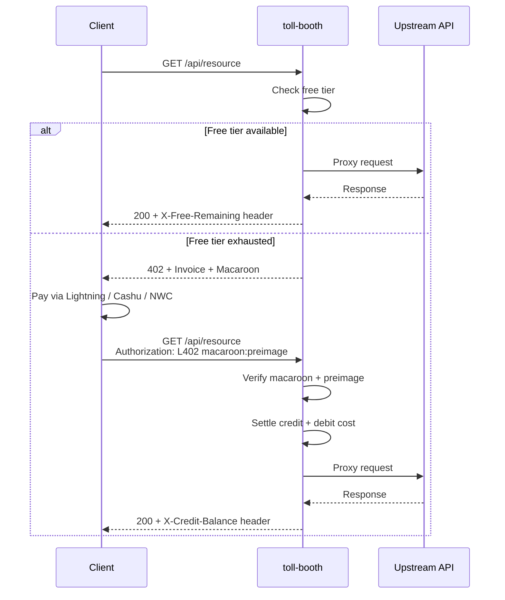

# toll-booth

**Nostr:** [`npub1mgvlrnf5hm9yf0n5mf9nqmvarhvxkc6remu5ec3vf8r0txqkuk7su0e7q2`](https://njump.me/npub1mgvlrnf5hm9yf0n5mf9nqmvarhvxkc6remu5ec3vf8r0txqkuk7su0e7q2)

[](https://github.com/forgesworn/toll-booth/actions/workflows/ci.yml)
[](./LICENSE)
[](https://primal.net/p/npub1mgvlrnf5hm9yf0n5mf9nqmvarhvxkc6remu5ec3vf8r0txqkuk7su0e7q2)
[](https://www.npmjs.com/package/@forgesworn/toll-booth)
[](https://www.typescriptlang.org/)
[](https://nodejs.org/)
[](https://github.com/sponsors/TheCryptoDonkey)

**Monetise any API with one line of code.**


[Live demo](https://jokes.trotters.dev/) - pay 21 sats, get a joke. No account. No sign-up. ([API](https://jokes.trotters.dev/api/joke))

### Try it now

```bash
npx @forgesworn/toll-booth demo
```

Spins up a fully working L402-gated joke API on localhost. Mock Lightning backend, in-memory storage, zero configuration. Scan the QR code from your terminal when the free tier runs out.

---

## Minimal example

```typescript
import express from 'express'
import { Booth } from '@forgesworn/toll-booth'
import { phoenixdBackend } from '@forgesworn/toll-booth/backends/phoenixd'

const app = express()
const booth = new Booth({
  adapter: 'express',
  backend: phoenixdBackend({ url: 'http://localhost:9740', password: process.env.PHOENIXD_PASSWORD! }),
  pricing: { '/api': 10 },           // 10 sats per request
  upstream: 'http://localhost:8080',  // your existing API
})

app.get('/invoice-status/:paymentHash', booth.invoiceStatusHandler as express.RequestHandler)
app.post('/create-invoice', booth.createInvoiceHandler as express.RequestHandler)
app.use('/', booth.middleware as express.RequestHandler)

app.listen(3000)
```

---

## The old way vs toll-booth

| | The old way | With toll-booth |
|---|---|---|
| **Step 1** | Create a Stripe account | `npm install @forgesworn/toll-booth` |
| **Step 2** | Verify your identity (KYC) | Set your pricing: `{ '/api': 10 }` |
| **Step 3** | Integrate billing SDK | `app.use(booth.middleware)` |
| **Step 4** | Build a sign-up page | Done. No sign-up page needed. |
| **Step 5** | Handle webhooks, refunds, chargebacks | Done. Payments are final. |

---

## Five zeroes

Zero accounts. Zero API keys. Zero chargebacks. Zero KYC. Zero vendor lock-in.

Your API earns money the moment it receives a request. Clients pay with Lightning, Cashu ecash, or NWC — no relationship with you required. Payments settle instantly and are cryptographically final — no disputes, no reversals, no Stripe risk reviews.

---

## See it in production

[**satgate**](https://github.com/TheCryptoDonkey/satgate) is a pay-per-token AI inference proxy built on toll-booth. It monetises any OpenAI-compatible endpoint — Ollama, vLLM, llama.cpp — with one command. Token counting, model pricing, streaming reconciliation, capacity management. Everything else — payments, credits, free tier, macaroon auth — is toll-booth.

~400 lines of product logic on top of the middleware. That's what "monetise any API with one line of code" looks like in practice.

---

## Let AI agents pay for your API

toll-booth is the **server side** of a two-part stack for machine-to-machine payments.
[402-mcp](https://github.com/forgesworn/402-mcp) is the **client side** - an MCP server that gives AI agents the ability to discover, pay, and consume L402-gated APIs autonomously.

```
AI Agent -> 402-mcp -> toll-booth -> Your API
```

An agent using Claude, GPT, or any MCP-capable model can call your API, receive a 402 payment challenge, pay the Lightning invoice from its wallet, and retry - all without human intervention. No OAuth dance, no API key rotation, no billing portal.

---

## Live demo

Visit [jokes.trotters.dev](https://jokes.trotters.dev/) in a browser to try it - get a free joke, hit the paywall, scan the QR code or pay with a browser wallet extension.

Or use the API directly:

```bash
# Get a free joke (1 free per day per IP)
curl https://jokes.trotters.dev/api/joke

# Free tier exhausted - request a Lightning invoice for 21 sats
curl -X POST https://jokes.trotters.dev/create-invoice

# Pay the invoice with any Lightning wallet, then authenticate
curl -H "Authorization: L402 <macaroon>:<preimage>" https://jokes.trotters.dev/api/joke
```

---

## Features

- **L402 protocol** - industry-standard HTTP 402 payment flow with macaroon credentials
- **Multiple Lightning backends** - Phoenixd, LND, CLN, LNbits, NWC (any Nostr Wallet Connect wallet)
- **Alternative payment methods** - Cashu ecash tokens and xcashu (NUT-24) direct-header payments
- **IETF Payment authentication** - implements [draft-ryan-httpauth-payment-01](https://datatracker.ietf.org/doc/draft-ryan-httpauth-payment/), the emerging standard for HTTP payment authentication. HMAC-bound stateless challenges with Lightning settlement.
- **x402 stablecoin payments** - accepts [x402](https://x402.org) on-chain stablecoin payments (USDC on Base, Polygon) alongside Lightning and Cashu simultaneously
- **Cashu-only mode** - no Lightning node required; ideal for serverless and edge deployments
- **Credit system** - pre-paid balance with volume discount tiers
- **Free tier** - configurable daily allowance (IP-hashed, no PII stored)
- **Privacy by design** - no personal data collected or stored; IP addresses are one-way hashed with a daily-rotating salt before any processing
- **Self-service payment page** - QR codes, tier selector, wallet adapter buttons
- **SQLite persistence** - WAL mode, automatic invoice expiry pruning
- **Three framework adapters** - Express, Web Standard (Deno/Bun/Workers), and Hono
- **Framework-agnostic core** - use the `Booth` facade or wire handlers directly

---

## Quick start

```bash
npm install @forgesworn/toll-booth
```

### Express

```typescript
import express from 'express'
import { Booth } from '@forgesworn/toll-booth'
import { phoenixdBackend } from '@forgesworn/toll-booth/backends/phoenixd'

const app = express()
app.use(express.json())

const booth = new Booth({
  adapter: 'express',
  backend: phoenixdBackend({
    url: 'http://localhost:9740',
    password: process.env.PHOENIXD_PASSWORD!,
  }),
  pricing: { '/api': 10 },           // 10 sats per request
  upstream: 'http://localhost:8080',  // your API
  rootKey: process.env.ROOT_KEY,      // 64 hex chars, required for production
})

app.get('/invoice-status/:paymentHash', booth.invoiceStatusHandler as express.RequestHandler)
app.post('/create-invoice', booth.createInvoiceHandler as express.RequestHandler)
app.use('/', booth.middleware as express.RequestHandler)

app.listen(3000)
```

### Web Standard (Deno / Bun / Workers)

```typescript
import { Booth } from '@forgesworn/toll-booth'
import { lndBackend } from '@forgesworn/toll-booth/backends/lnd'

const booth = new Booth({
  adapter: 'web-standard',
  backend: lndBackend({
    url: 'https://localhost:8080',
    macaroon: process.env.LND_MACAROON!,
  }),
  pricing: { '/api': 5 },
  upstream: 'http://localhost:8080',
})

// Deno example
Deno.serve({ port: 3000 }, async (req: Request) => {
  const url = new URL(req.url)
  if (url.pathname.startsWith('/invoice-status/'))
    return booth.invoiceStatusHandler(req)
  if (url.pathname === '/create-invoice' && req.method === 'POST')
    return booth.createInvoiceHandler(req)
  return booth.middleware(req)
})
```

### Hono

```typescript
import { Hono } from 'hono'
import { createHonoTollBooth, type TollBoothEnv } from '@forgesworn/toll-booth/hono'
import { phoenixdBackend } from '@forgesworn/toll-booth/backends/phoenixd'
import { createTollBooth } from '@forgesworn/toll-booth'
import { sqliteStorage } from '@forgesworn/toll-booth/storage/sqlite'

const storage = sqliteStorage({ path: './toll-booth.db' })
const engine = createTollBooth({
  backend: phoenixdBackend({ url: 'http://localhost:9740', password: process.env.PHOENIXD_PASSWORD! }),
  storage,
  pricing: { '/api': 10 },
  upstream: 'http://localhost:8080',
  rootKey: process.env.ROOT_KEY!,
})

const tollBooth = createHonoTollBooth({ engine })
const app = new Hono<TollBoothEnv>()

// Mount payment routes
app.route('/', tollBooth.createPaymentApp({
  storage,
  rootKey: process.env.ROOT_KEY!,
  tiers: [],
  defaultAmount: 1000,
}))

// Gate your API
app.use('/api/*', tollBooth.authMiddleware)
app.get('/api/resource', (c) => {
  const balance = c.get('tollBoothCreditBalance')
  return c.json({ message: 'Paid content', balance })
})

export default app
```

### Cashu-only (no Lightning node)

```typescript
import { Booth } from '@forgesworn/toll-booth'

const booth = new Booth({
  adapter: 'web-standard',
  redeemCashu: async (token, paymentHash) => {
    // Verify and redeem the ecash token with your Cashu mint
    // Return the amount redeemed in satoshis
    return amountRedeemed
  },
  pricing: { '/api': 5 },
  upstream: 'http://localhost:8080',
})
```

No Lightning node, no channels, no liquidity management. Ideal for serverless and edge deployments.

### xcashu (Cashu ecash via NUT-24)

```typescript
import { Booth } from '@forgesworn/toll-booth'

const booth = new Booth({
  adapter: 'web-standard',
  xcashu: {
    mints: ['https://mint.minibits.cash'],
    unit: 'sat',
  },
  pricing: { '/api': 10 },
  upstream: 'http://localhost:3000',
})
```

Clients pay by sending `X-Cashu: cashuB...` tokens in the request header. Proofs are verified and swapped at the configured mint(s) using cashu-ts.

Unlike the `redeemCashu` callback (which integrates Cashu into the L402 payment-and-redeem flow), `xcashu` is a self-contained payment rail: the client attaches a token directly to the API request and gets access in one step — no separate redeem endpoint required. Both rails can run simultaneously; the 402 challenge will include both `WWW-Authenticate` (L402) and `X-Cashu` headers.

### IETF Payment (draft-ryan-httpauth-payment-01)

```typescript
const booth = new Booth({
  adapter: 'express',
  backend: phoenixdBackend({ url: '...', password: '...' }),
  ietfPayment: {
    realm: 'api.example.com',
    // hmacSecret auto-derived from rootKey if omitted
  },
  pricing: { '/api': 10 },
  upstream: 'http://localhost:8080',
})
```

Implements the [IETF Payment authentication scheme](https://datatracker.ietf.org/doc/draft-ryan-httpauth-payment/) - the emerging standard for HTTP payment authentication. Challenges are stateless (HMAC-SHA256 bound, no database lookup on verify), with JCS-encoded charge requests and timing-safe validation. The 402 response includes a `WWW-Authenticate: Payment` header alongside the L402 challenge, so clients can use whichever scheme they support.

---

## Guides

- [Monetise any Express API in 60 seconds](docs/guides/express-quickstart.md)
- [Monetise your Ollama endpoint](docs/guides/ollama-monetisation.md)
- [Let AI agents pay for your API](docs/guides/ai-agent-payments.md)

---

## Case studies

- [satgate: Pay-per-token AI inference](docs/case-studies/satgate.md)
- [jokes.trotters.dev: From zero to production L402 API](docs/case-studies/jokes-trotters-dev.md)

---

## Lightning backends

```typescript
import { phoenixdBackend } from '@forgesworn/toll-booth/backends/phoenixd'
import { lndBackend } from '@forgesworn/toll-booth/backends/lnd'
import { clnBackend } from '@forgesworn/toll-booth/backends/cln'
import { lnbitsBackend } from '@forgesworn/toll-booth/backends/lnbits'
import { nwcBackend } from '@forgesworn/toll-booth/backends/nwc'
```

Each backend implements the `LightningBackend` interface (`createInvoice` + `checkInvoice`).

| Backend | Status | Notes |
|---------|--------|-------|
| Phoenixd | Stable | Simplest self-hosted option |
| LND | Stable | Industry standard |
| CLN | Stable | Core Lightning REST API |
| LNbits | Stable | Any LNbits instance - self-hosted or hosted |
| NWC | Stable | Any Nostr Wallet Connect wallet (Alby Hub, Mutiny, Umbrel, Phoenix, etc.) — E2E encrypted via NIP-44 |

---

## Why not Aperture?

[Aperture](https://github.com/lightninglabs/aperture) is Lightning Labs' production L402 reverse proxy. It's battle-tested and feature-rich. Use it if you can.

| | Aperture | toll-booth |
|---|---|---|
| **Language** | Go binary | TypeScript middleware |
| **Deployment** | Standalone reverse proxy | Embeds in your app, or runs as a gateway in front of any HTTP service |
| **Lightning node** | Requires LND | Phoenixd, LND, CLN, LNbits, NWC, or none (Cashu-only) |
| **Payment rails** | Lightning only | Lightning, Cashu ecash, xcashu (NUT-24), x402 stablecoins, IETF Payment - simultaneously |
| **IETF Payment** | No | Yes - [draft-ryan-httpauth-payment-01](https://datatracker.ietf.org/doc/draft-ryan-httpauth-payment/) with stateless HMAC challenges |
| **x402 stablecoins** | No | Yes - USDC on Base, Polygon via pluggable facilitator |
| **Cashu ecash** | No | Yes - redeemCashu callback + xcashu (NUT-24) direct-header rail |
| **Credit system** | No | Pre-paid balance with volume discount tiers |
| **Framework adapters** | N/A (standalone proxy) | Express, Web Standard (Deno/Bun/Workers), Hono |
| **Serverless** | No - long-running process | Yes - Web Standard adapter runs on Cloudflare Workers, Deno, Bun |
| **Configuration** | YAML file | Programmatic (code) |

For a detailed comparison with all alternatives, see [docs/comparison.md](docs/comparison.md).

---

## x402 stablecoin payments

[x402](https://x402.org) is Coinbase's HTTP 402 payment protocol for on-chain stablecoins. toll-booth speaks it natively. A single deployment accepts Lightning **and** x402 stablecoins **and** Cashu — simultaneously. The seller doesn't care how they get paid. They just want paid.

```typescript
const booth = new Booth({
  adapter: 'express',
  backend: phoenixdBackend({ url: '...', password: '...' }),
  x402: {
    receiverAddress: '0x1234...abcd',
    network: 'base',
    facilitator: myFacilitator, // verifies on-chain settlement
  },
  pricing: { '/api': { sats: 10, usd: 5 } }, // price in both currencies
  upstream: 'http://localhost:8080',
})
```

The 402 challenge includes both `WWW-Authenticate` (L402) and `Payment-Required` (x402) headers. Clients choose their preferred rail. x402 payments settle into the same credit system as Lightning — volume discount tiers apply regardless of payment method.

The unique value of toll-booth isn't any single payment rail. It's the **middleware layer**: gating, credit accounting, free tiers, volume discounts, upstream proxying, and macaroon credentials — all framework-agnostic, all runtime-agnostic, all payment-rail agnostic. Payment protocols are pluggable rails. toll-booth is the booth.

---

## Using toll-booth with any API

toll-booth works as a **reverse proxy gateway**, so the upstream API can be written in any language - C#, Go, Python, Ruby, Java, or anything else that speaks HTTP. The upstream service doesn't need to know about L402 or Lightning; it just receives normal requests.

```
Client ---> toll-booth (Node.js) ---> Your API (any language)
                |                          |
          L402 payment gating        Plain HTTP requests
          Macaroon verification      X-Credit-Balance header added
```

Point `upstream` at your existing service:

```typescript
const booth = new Booth({
  adapter: 'express',
  backend: phoenixdBackend({ url: '...', password: '...' }),
  pricing: { '/api/search': 5, '/api/generate': 20 },
  upstream: 'http://my-dotnet-api:5000',  // ASP.NET, FastAPI, Gin, Rails...
})
```

Deploy toll-booth as a sidecar (Docker Compose, Kubernetes) or as a standalone gateway in front of multiple services. See [`examples/valhalla-proxy/`](examples/valhalla-proxy/) for a complete Docker Compose reference - the Valhalla routing engine it gates is a C++ service.

---

## Production checklist

- **Set a persistent `rootKey`** (64 hex chars / 32 bytes). Without it, a random key is generated per restart and all existing macaroons become invalid. Generate one with: `node -e "console.log(require('crypto').randomBytes(32).toString('hex'))"`
- Use a persistent `dbPath` (default: `./toll-booth.db`).
- Enable `strictPricing: true` to prevent unpriced routes from bypassing billing.
- Ensure your `pricing` keys match the paths the middleware actually sees (after mounting).
- Set `trustProxy: true` when behind a reverse proxy, or provide a `getClientIp` callback for per-client free-tier isolation.
- If you implement `redeemCashu`, make it idempotent for the same `paymentHash` - crash recovery depends on it.
- Rate-limit `/create-invoice` at your reverse proxy - each call creates a real Lightning invoice.
- You can also enable `invoiceRateLimit.maxPendingPerIp` in the Booth config to cap pending unpaid invoices per client IP. The cap applies to both `POST /create-invoice` and the 402 challenge issued by any priced endpoint — over the cap, the engine returns HTTP 429 (`Retry-After: 3600`) instead of minting another invoice.

---

## Example deployments

### sats-for-laughs - build your own paid API

[`examples/sats-for-laughs/`](examples/sats-for-laughs/) is the fastest path from "I have an API" to "my API earns sats". It's the same code that runs the [live demo](https://jokes.trotters.dev/). Includes a web frontend with QR codes and wallet adapter buttons, plus a JSON API for programmatic access. Clone it, change three env vars, deploy.

```bash
cd examples/sats-for-laughs
cp .env.example .env          # add your Phoenixd credentials
docker compose up -d          # or: MOCK=true npm start
```

Includes mock mode for local development (auto-settles invoices, no Lightning node needed), Docker Compose with Phoenixd, and a pre-generated pool of 100+ jokes across six topics.

### valhalla-proxy - production reference

[`examples/valhalla-proxy/`](examples/valhalla-proxy/) gates the [Valhalla](https://github.com/valhalla/valhalla) routing engine (a C++ service) behind Lightning payments. Full Docker Compose setup demonstrating toll-booth as a sidecar proxy in front of non-JavaScript infrastructure.

---

## Payment flow


```mermaid
sequenceDiagram
    participant C as Client
    participant T as toll-booth
    participant U as Upstream API

    C->>T: GET /api/resource
    T->>T: Check free tier
    alt Free tier available
        T->>U: Proxy request
        U-->>T: Response
        T-->>C: 200 + X-Free-Remaining header
    else Free tier exhausted
        T-->>C: 402 + Invoice + Macaroon
        C->>C: Pay via Lightning / Cashu / NWC
        C->>T: GET /api/resource<br/>Authorization: L402 macaroon:preimage
        T->>T: Verify macaroon + preimage
        T->>T: Settle credit + debit cost
        T->>U: Proxy request
        U-->>T: Response
        T-->>C: 200 + X-Credit-Balance header
    end
```

1. Client requests a priced endpoint without credentials
2. Free tier checked - if allowance remains, request passes through
3. If exhausted - **402** response with BOLT-11 invoice + macaroon
4. Client pays via Lightning, NWC, or Cashu
5. Client sends `Authorization: L402 <macaroon>:<preimage>`
6. Macaroon verified, credit deducted, request proxied upstream

---

## Event hooks

Three optional callbacks let you observe the payment lifecycle without modifying the core flow:

```typescript
const booth = new Booth({
  adapter: 'express',
  backend: phoenixdBackend({ url: '...', password: '...' }),
  pricing: { '/api': 10 },
  upstream: 'http://localhost:8080',

  // Fired once per payment hash on first successful authentication
  onPayment: (event) => {
    console.log(`Received ${event.amountSats} sats via ${event.rail} (${event.paymentHash})`)
    // event: { timestamp, paymentHash, amountSats, currency, rail }
  },

  // Fired on every authenticated or free-tier request
  onRequest: (event) => {
    console.log(`${event.endpoint} -${event.satsDeducted} sats, ${event.remainingBalance} remaining`)
    // event: { timestamp, endpoint, satsDeducted, remainingBalance, latencyMs, authenticated, currency, tier }
  },

  // Fired when a 402 payment challenge is issued
  onChallenge: (event) => {
    console.log(`Challenged ${event.endpoint} for ${event.amountSats} sats`)
    // event: { timestamp, endpoint, amountSats }
  },
})
```

Use these for logging, analytics, webhook dispatch, or feeding a metrics pipeline. They fire synchronously in the request path, so keep them fast. For Hono, these same callbacks are available in the `createTollBooth()` engine config.

---

## Selective route gating

toll-booth only gates routes that appear in the `pricing` map. Unpriced routes pass through free by default.

```typescript
const booth = new Booth({
  adapter: 'express',
  backend: phoenixdBackend({ url: '...', password: '...' }),
  pricing: {
    '/api/premium': 100,    // 100 sats per request
    '/api/generate': 50,    // 50 sats per request
  },
  upstream: 'http://localhost:8080',
})

app.get('/invoice-status/:paymentHash', booth.invoiceStatusHandler as express.RequestHandler)
app.post('/create-invoice', booth.createInvoiceHandler as express.RequestHandler)
app.use('/', booth.middleware as express.RequestHandler)

// /api/premium and /api/generate are gated (402 if no credits)
// /api/search, /health, /docs, etc. pass through free
```

Alternatively, mount the middleware on a specific path prefix so it only runs for a subset of routes:

```typescript
// Only requests under /api/paid go through toll-booth
app.use('/api/paid', booth.middleware as express.RequestHandler)

// These routes are completely unaffected
app.get('/api/free', (req, res) => res.json({ free: true }))
app.get('/health', (req, res) => res.json({ ok: true }))
```

To gate everything by default (opt-out instead of opt-in), enable `strictPricing`. Any route not in the pricing map will receive a 402 challenge at the `defaultInvoiceAmount`:

```typescript
const booth = new Booth({
  adapter: 'express',
  backend: phoenixdBackend({ url: '...', password: '...' }),
  pricing: { '/health': 0 },    // explicitly free
  strictPricing: true,           // everything else costs defaultInvoiceAmount
  defaultInvoiceAmount: 10,
  upstream: 'http://localhost:8080',
})
```

---

## Custom macaroon caveats

Add application-specific restrictions to macaroons via the `/create-invoice` endpoint. Custom caveats are forwarded to your upstream service as `X-Toll-Caveat-*` headers, so your API can enforce them.

```bash
# Request an invoice with custom caveats
curl -X POST https://api.example.com/create-invoice \
  -H 'Content-Type: application/json' \
  -d '{
    "amountSats": 1000,
    "caveats": ["model = llama3", "tier = premium", "expires = 2026-06-01T00:00:00Z"]
  }'
```

When the client authenticates with this macaroon, toll-booth parses the caveats and forwards them as headers to your upstream:

```
X-Toll-Caveat-Model: llama3
X-Toll-Caveat-Tier: premium
```

Your upstream API reads these headers to enforce access control. Here's a complete Express example with validation and error handling:

```typescript
app.get('/api/generate', (req, res) => {
  // Read custom caveats from toll-booth headers
  const model = req.headers['x-toll-caveat-model'] as string | undefined
  const tier = req.headers['x-toll-caveat-tier'] as string | undefined
  const balance = Number(req.headers['x-credit-balance'] ?? 0)

  // Enforce model restriction
  const allowedModels = ['llama3', 'mistral', 'gemma']
  if (model && !allowedModels.includes(model)) {
    return res.status(403).json({ error: `Model "${model}" not authorised for this macaroon` })
  }

  // Enforce tier restriction
  if (tier === 'basic' && req.body.stream) {
    return res.status(403).json({ error: 'Streaming not available on basic tier' })
  }

  // Use the model caveat to route the request
  const targetModel = model ?? 'llama3'  // default if no caveat
  // ... proceed with generation using targetModel
})
```

For Hono, custom caveats are available via context variables set by the auth middleware:

```typescript
app.get('/api/generate', (c) => {
  const balance = c.get('tollBoothCreditBalance')
  const hash = c.get('tollBoothPaymentHash')

  // Custom caveats are in the proxied request headers
  const model = c.req.header('x-toll-caveat-model')
  // ... enforce as needed
})
```

### Built-in vs custom caveats

**Built-in caveats** are verified automatically by toll-booth during macaroon verification. The client never reaches your upstream if these fail:

| Caveat | Effect | Example |
|--------|--------|---------|
| `route = /api/*` | Restrict the macaroon to specific paths. Supports `/*` prefix matching. | Only allows requests under `/api/` |
| `expires = 2026-06-01T00:00:00Z` | Time-limited access. Rejected after the timestamp. | 30-day access pass |
| `ip = 203.0.113.1` | Bind the macaroon to a specific client IP. | Prevent credential sharing |

**Custom caveats** (any key not in the reserved list) are parsed by toll-booth and forwarded to your upstream as `X-Toll-Caveat-*` headers. Your upstream is responsible for enforcing them. Up to 16 custom caveats per macaroon, max 1024 characters each.

**Reserved caveat keys** (`payment_hash`, `credit_balance`, `currency`) cannot be set via the API; they are managed internally by toll-booth.

### Security properties of caveats

Caveats are cryptographically bound to the macaroon's HMAC chain. A client cannot remove or modify existing caveats. However, macaroons allow anyone to *append* additional caveats (which can only narrow permissions, never widen them). toll-booth handles this safely:

- **Duplicate caveats are rejected** during verification
- **First-occurrence-wins** parsing ensures server-set values take precedence over any appended duplicates
- **Caveat values are sanitised** (newlines stripped to prevent header injection)

---

## Accessing payment state in handlers

After successful authentication, payment details are available to downstream code.

### Hono - context variables

Hono handlers access payment state via typed context variables:

```typescript
import { Hono } from 'hono'
import { createHonoTollBooth, type TollBoothEnv } from '@forgesworn/toll-booth/hono'

const app = new Hono<TollBoothEnv>()
app.use('/api/*', tollBooth.authMiddleware)

app.get('/api/resource', (c) => {
  const balance = c.get('tollBoothCreditBalance')    // remaining credits in sats
  const hash = c.get('tollBoothPaymentHash')          // payment hash (if just paid)
  const cost = c.get('tollBoothEstimatedCost')         // cost of this request in sats
  const free = c.get('tollBoothFreeRemaining')         // free-tier requests left
  const tier = c.get('tollBoothTier')                  // credit tier name
  const action = c.get('tollBoothAction')              // 'proxy' | 'pass'

  return c.json({ message: 'Paid content', balance, tier })
})
```

### Express / Web Standard - response headers

Express and Web Standard adapters add headers to the response returned to the client:

| Header | When | Value |
|--------|------|-------|
| `X-Credit-Balance` | After authenticated request | Remaining credit balance in sats |
| `X-Free-Remaining` | During free-tier request | Free-tier requests remaining today |

```typescript
// Client-side: read balance from response headers
const res = await fetch('https://api.example.com/api/resource', {
  headers: { Authorization: `L402 ${macaroon}:${preimage}` },
})
const balance = Number(res.headers.get('X-Credit-Balance'))
console.log(`Credits remaining: ${balance} sats`)
```

For upstream services (behind the proxy), toll-booth adds `X-Credit-Balance` and any `X-Toll-Caveat-*` headers to the proxied request, so your backend can read the authenticated user's state.

---

## Customising the 402 response

When toll-booth issues a 402 challenge, you can control both the HTTP headers and the JSON body.

### Custom HTTP headers

Use `responseHeaders` to add arbitrary headers to every response, including 402 challenges:

```typescript
const booth = new Booth({
  adapter: 'express',
  backend: phoenixdBackend({ url: '...', password: '...' }),
  pricing: { '/api': 10 },
  upstream: 'http://localhost:8080',
  responseHeaders: {
    'X-Powered-By': 'toll-booth',
    'Access-Control-Allow-Origin': '*',
    'X-Custom-Header': 'my-value',
  },
})
```

These headers appear on 402 challenges, proxied responses, and error responses alike.

### Service metadata in the 402 body

Set `serviceName` and `description` to include machine-readable service metadata in the 402 response body:

```typescript
const booth = new Booth({
  adapter: 'express',
  backend: phoenixdBackend({ url: '...', password: '...' }),
  pricing: { '/api': 10 },
  upstream: 'http://localhost:8080',
  serviceName: 'my-api',
  description: 'Premium data API with real-time market feeds',
})
```

The 402 response body will include:

```json
{
  "message": "Payment required.",
  "booth": {
    "name": "my-api",
    "description": "Premium data API with real-time market feeds"
  },
  "auth_hint": "L402: Pay the invoice, then send — Authorization: L402 <macaroon>:<preimage>",
  "l402": {
    "scheme": "L402",
    "description": "Buy credits — pay once, reuse for multiple requests",
    "invoice": "lnbc...",
    "macaroon": "AgE...",
    "payment_hash": "abc123...",
    "amount_sats": 10,
    "payment_url": "/invoice-status/abc123...?token=...",
    "status_token": "..."
  }
}
```

When multiple payment rails are active (e.g. L402 + x402 + xcashu), the body includes sections for each rail, and `auth_hint` becomes an array of instructions.

### Volume discount tiers in the 402 body

When `creditTiers` are configured, the 402 body includes them so clients can offer volume discounts:

```typescript
const booth = new Booth({
  adapter: 'express',
  backend: phoenixdBackend({ url: '...', password: '...' }),
  pricing: { '/api': 10 },
  upstream: 'http://localhost:8080',
  creditTiers: [
    { amountSats: 1000, creditSats: 1000, label: '1k sats' },
    { amountSats: 5000, creditSats: 5550, label: '5k sats (11% bonus)' },
    { amountSats: 10000, creditSats: 11100, label: '10k sats (11% bonus)' },
  ],
})
```

The 402 body will include a `credit_tiers` array with the tier options.

### Full 402 response structure

| Field | Always present | Description |
|-------|---------------|-------------|
| `message` | Yes | `"Payment required."` |
| `l402` | When L402 rail is active | Invoice, macaroon, payment hash, amount, payment URL |
| `booth` | When `serviceName` is set | `{ name, description }` service metadata |
| `auth_hint` | When `serviceName` is set | Human/agent-readable instructions for each active payment rail |
| `tiers` | For tiered-pricing routes | Available pricing tiers for the requested route |
| `credit_tiers` | When `creditTiers` is set | Volume discount options |

The `WWW-Authenticate` header follows RFC 9110 and includes credentials for each active rail (e.g. `L402 macaroon="...", invoice="..."` and/or `Payment ...` and/or `X-Cashu ...`).

---

## Configuration

The five most common options:

| Option | Type | Description |
|--------|------|-------------|
| `adapter` | `'express' \| 'web-standard'` | Framework integration to use. For Hono, use `createHonoTollBooth()` from `@forgesworn/toll-booth/hono` instead. |
| `backend` | `LightningBackend` | Lightning node (optional if using Cashu-only) |
| `pricing` | `Record<string, number>` | Route pattern to cost in sats |
| `upstream` | `string` | URL to proxy authorised requests to |
| `freeTier` | `{ requestsPerDay: number }` or `{ creditsPerDay: number }` | Daily free allowance per IP (request-count or sats-budget) |

See [docs/configuration.md](docs/configuration.md) for the full reference including `rootKey`, `creditTiers`, `trustProxy`, `nwcPayInvoice`, `redeemCashu`, and all other options.

---

## Documentation

| Document | Description |
|----------|-------------|
| **[Why L402?](docs/vision.md)** | The case for permissionless, machine-to-machine payments |
| **[Architecture](docs/architecture.md)** | How toll-booth, satgate, and 402-mcp fit together |
| **[Configuration](docs/configuration.md)** | Full reference for all Booth options |
| **[Deployment](docs/deployment.md)** | Docker, nginx, Cloudflare Workers, Deno, Bun, Hono |
| **[Security](docs/security.md)** | Threat model, macaroon security, hardening measures |
| **[Migration](docs/migration.md)** | Upgrading from v1 to v2, and v2 to v3 |
| **[Contributing](CONTRIBUTING.md)** | Development setup, conventions, adding backends |

---

## Ecosystem

| Project | Role |
|---------|------|
| **[toll-booth](https://github.com/forgesworn/toll-booth)** | **Payment-rail agnostic HTTP 402 middleware** |
| [satgate](https://github.com/TheCryptoDonkey/satgate) | Production showcase — pay-per-token AI inference proxy (~400 lines on toll-booth) |
| [402-announce](https://github.com/forgesworn/402-announce) | Publish your toll-booth services on Nostr (kind 31402) for discovery |
| [402-mcp](https://github.com/forgesworn/402-mcp) | Client side — AI agents discover, pay, and consume L402 APIs |

---

## Support

If you find toll-booth useful, consider sending a tip:

- **Lightning:** `thedonkey@strike.me`
- **Nostr zaps:** `npub1mgvlrnf5hm9yf0n5mf9nqmvarhvxkc6remu5ec3vf8r0txqkuk7su0e7q2`

## Part of the ForgeSworn Toolkit

[ForgeSworn](https://forgesworn.dev) builds open-source cryptographic identity, payments, and coordination tools for Nostr.

| Library | What it does |
|---------|-------------|
| [nsec-tree](https://github.com/forgesworn/nsec-tree) | Deterministic sub-identity derivation |
| [ring-sig](https://github.com/forgesworn/ring-sig) | SAG/LSAG ring signatures on secp256k1 |
| [range-proof](https://github.com/forgesworn/range-proof) | Pedersen commitment range proofs |
| [canary-kit](https://github.com/forgesworn/canary-kit) | Coercion-resistant spoken verification |
| [spoken-token](https://github.com/forgesworn/spoken-token) | Human-speakable verification tokens |
| [toll-booth](https://github.com/forgesworn/toll-booth) | L402 payment middleware |
| [geohash-kit](https://github.com/forgesworn/geohash-kit) | Geohash toolkit with polygon coverage |
| [nostr-attestations](https://github.com/forgesworn/nostr-attestations) | NIP-VA verifiable attestations |
| [dominion](https://github.com/forgesworn/dominion) | Epoch-based encrypted access control |
| [nostr-veil](https://github.com/forgesworn/nostr-veil) | Privacy-preserving Web of Trust |

## Licence

[MIT](LICENSE)
