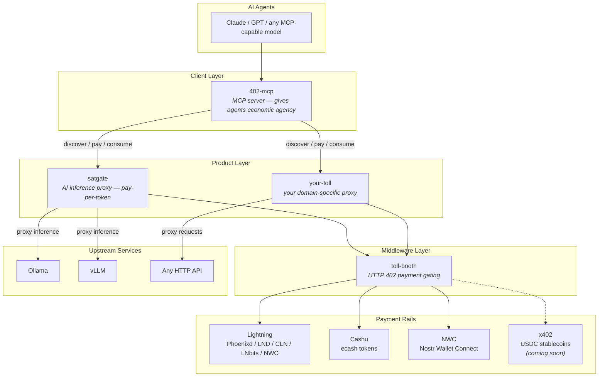
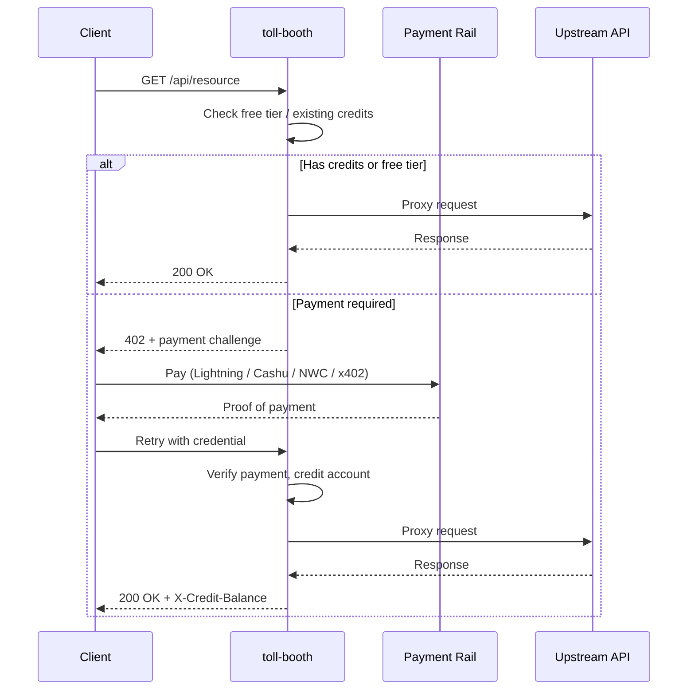
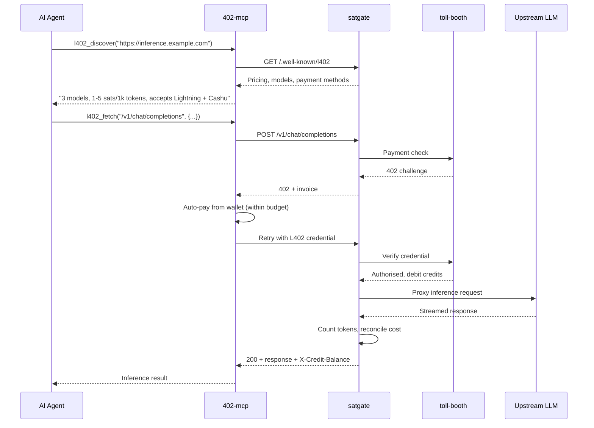
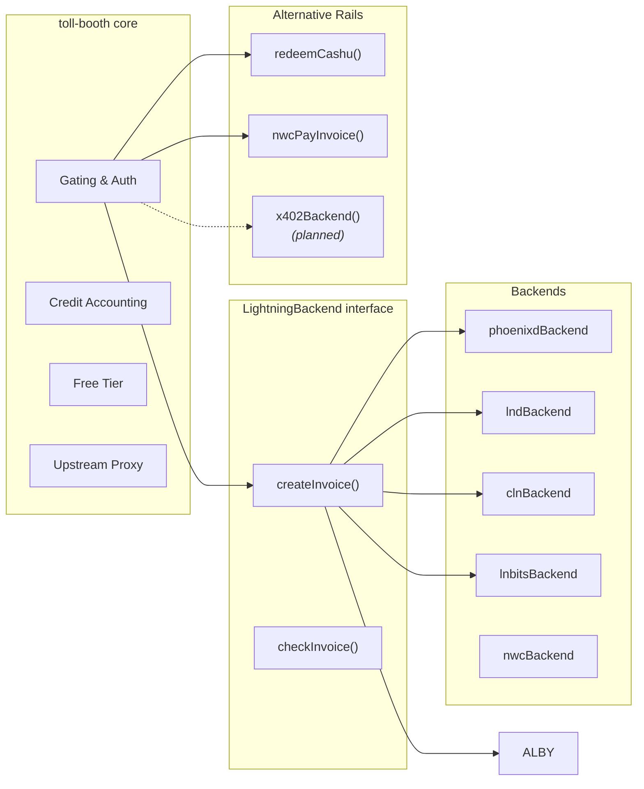
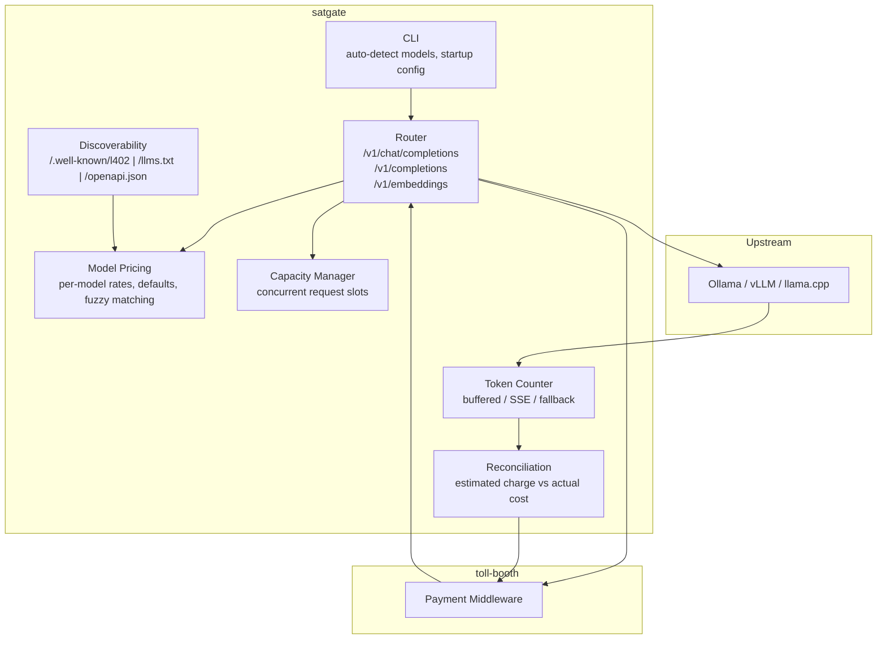

# Architecture

The toll-booth ecosystem has three layers: a payment middleware, domain-specific proxies, and an agent client. Payment rails are pluggable — the layers above don't care how money moves.

## Ecosystem overview

## Payment flow

The HTTP 402 challenge-response cycle. Same flow regardless of payment rail.

## Agent-pays-agent flow

An AI agent autonomously discovers, pays for, and consumes an API — no human in the loop.

## Payment rail abstraction

toll-booth treats payment rails as pluggable backends. Each implements a simple interface — the middleware layer doesn't know or care which rail settled the payment.

## satgate: inference-specific layer

satgate adds AI-specific concerns on top of toll-booth's payment gating.

## The stack at a glance

| Layer | Project | What it does | What it doesn't do |
|-------|---------|-------------|-------------------|
| **Client** | [402-mcp](https://github.com/forgesworn/402-mcp) | Discovers, pays, consumes L402 APIs | Doesn't gate or price anything |
| **Product** | [satgate](https://github.com/TheCryptoDonkey/satgate) | Token counting, model pricing, capacity, streaming | Doesn't handle payments directly |
| **Middleware** | [toll-booth](https://github.com/forgesworn/toll-booth) | Payment gating, credit accounting, free tiers | Doesn't know about tokens or models |
| **Rails** | Lightning / Cashu / NWC / x402 | Moves money | Doesn't know about HTTP or APIs |

Each layer does one thing. The boundaries are sharp. Swap any layer without touching the others.
