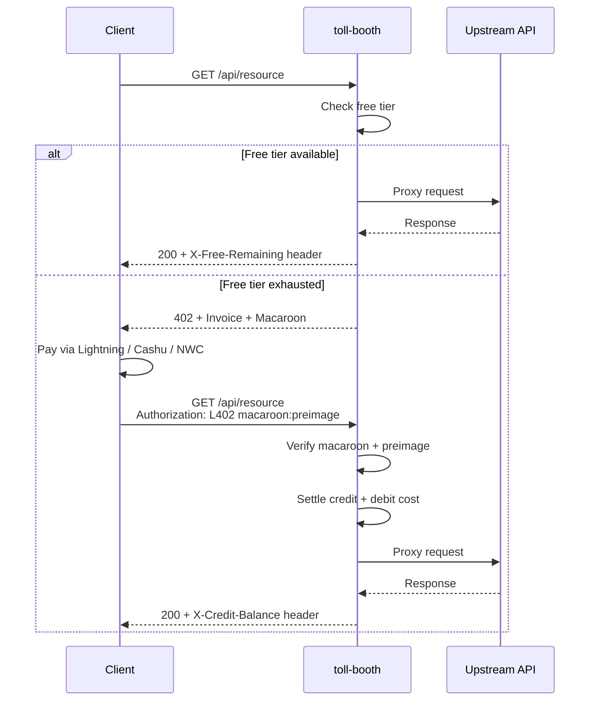

# Configuration

## Booth constructor options

The `Booth` constructor accepts:

| Option | Type | Description |
|--------|------|-------------|
| `adapter` | `'express' \| 'web-standard'` | Framework integration to use |
| `backend` | `LightningBackend` | Lightning node (optional if using Cashu-only) |
| `pricing` | `Record<string, number>` | Route pattern → cost in sats |
| `upstream` | `string` | URL to proxy authorised requests to |
| `rootKey` | `string` | Macaroon signing key (64 hex chars). Random if omitted |
| `dbPath` | `string` | SQLite path. Default: `./toll-booth.db` |
| `storage` | `StorageBackend` | Custom storage (alternative to `dbPath`) |
| `freeTier` | `{ requestsPerDay: number }` or `{ creditsPerDay: number }` | Daily free allowance per IP (request-count or sats-budget) |
| `strictPricing` | `boolean` | Challenge unpriced routes instead of passing through |
| `creditTiers` | `CreditTier[]` | Volume discount tiers |
| `trustProxy` | `boolean` | Trust `X-Forwarded-For` / `X-Real-IP` |
| `getClientIp` | `(req) => string` | Custom IP resolver for non-standard runtimes |
| `responseHeaders` | `Record<string, string>` | Extra headers on every response |
| `nwcPayInvoice` | `(uri, bolt11) => Promise<string>` | NWC payment callback |
| `redeemCashu` | `(token, hash) => Promise<number>` | Cashu redemption callback |
| `invoiceMaxAgeMs` | `number` | Invoice pruning age. Default: 24h. `0` to disable |
| `upstreamTimeout` | `number` | Proxy timeout in ms. Default: 30s |

## Subpath exports

Tree-shakeable imports for bundlers:

```typescript
import { Booth } from '@forgesworn/toll-booth'
import { phoenixdBackend } from '@forgesworn/toll-booth/backends/phoenixd'
import { sqliteStorage } from '@forgesworn/toll-booth/storage/sqlite'
import { memoryStorage } from '@forgesworn/toll-booth/storage/memory'
import { createExpressMiddleware } from '@forgesworn/toll-booth/adapters/express'
import { createWebStandardMiddleware } from '@forgesworn/toll-booth/adapters/web-standard'
```

## Payment flow



1. Client requests a priced endpoint without credentials
2. Free tier checked — if allowance remains, request passes through
3. If exhausted → **402** response with BOLT-11 invoice + macaroon
4. Client pays via Lightning, NWC, or Cashu
5. Client sends `Authorization: L402 <macaroon>:<preimage>`
6. Macaroon verified, credit deducted, request proxied upstream
