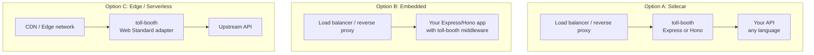
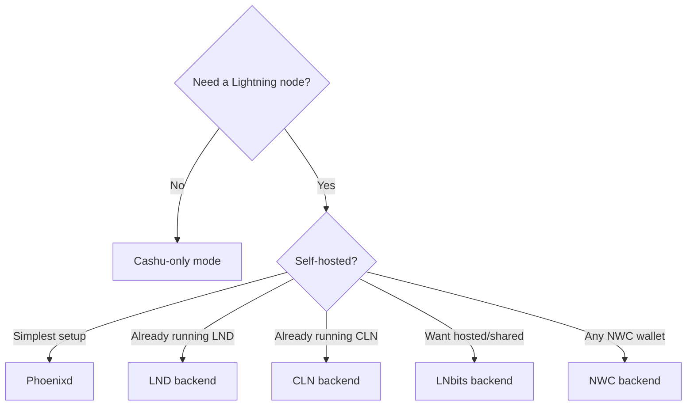

# Deployment Guide

toll-booth runs anywhere Node.js runs. This guide covers common deployment patterns, from Docker Compose to serverless edge functions.

## Deployment architecture



**Sidecar** - toll-booth runs as a separate process in front of your API. Best when the upstream is written in another language (Go, Python, C++, etc.). See [valhalla-proxy](../examples/valhalla-proxy/) for a complete example.

**Embedded** - toll-booth middleware is wired directly into your Express or Hono application. Best when you're already running a Node.js/Bun server. Fewer moving parts.

**Edge / Serverless** - toll-booth runs on Cloudflare Workers, Deno Deploy, or similar platforms using the Web Standard adapter. Requires Cashu-only mode (no persistent Lightning node) or an external Lightning backend accessible via HTTP.

---

## Docker Compose

The most common production deployment. See [`examples/valhalla-proxy/`](../examples/valhalla-proxy/) for the complete reference.

```yaml
services:
  toll-booth:
    build: .
    restart: always
    ports:
      - "0.0.0.0:3000:3000"
    environment:
      - PHOENIXD_URL=http://phoenixd:9740
      - PHOENIXD_PASSWORD=${PHOENIXD_PASSWORD}
      - ROOT_KEY=${ROOT_KEY}
      - TOLL_BOOTH_DB_PATH=/data/toll-booth.db
      - TRUST_PROXY=true
    volumes:
      - toll-booth-data:/data
    depends_on:
      - phoenixd

  phoenixd:
    image: ghcr.io/acinq/phoenixd:latest
    restart: always
    volumes:
      - phoenixd-data:/root/.phoenix
    command: ["--agree-to-terms-of-service", "--http-bind-ip", "0.0.0.0"]

volumes:
  toll-booth-data:
  phoenixd-data:
```

**Key points:**
- Mount a Docker volume for `TOLL_BOOTH_DB_PATH` so the SQLite database survives container restarts
- Keep Phoenixd's port on `127.0.0.1` (or internal Docker network only); it should not be publicly accessible
- Set `TRUST_PROXY=true` if running behind a load balancer or reverse proxy

### Dockerfile

```dockerfile
FROM node:22-slim
WORKDIR /app
COPY package.json package-lock.json ./
RUN npm ci --omit=dev
COPY dist/ ./dist/
EXPOSE 3000
CMD ["node", "dist/server.js"]
```

---

## Reverse proxy (nginx / Caddy)

When running toll-booth behind a reverse proxy, configure it to forward client IPs and set `trustProxy: true` in toll-booth.

### nginx

```nginx
server {
    listen 443 ssl http2;
    server_name api.example.com;

    location / {
        proxy_pass http://127.0.0.1:3000;
        proxy_set_header Host $host;
        proxy_set_header X-Real-IP $remote_addr;
        proxy_set_header X-Forwarded-For $proxy_add_x_forwarded_for;
        proxy_set_header X-Forwarded-Proto $scheme;
    }

    # Rate-limit invoice creation
    location = /create-invoice {
        limit_req zone=invoices burst=5 nodelay;
        proxy_pass http://127.0.0.1:3000;
        proxy_set_header Host $host;
        proxy_set_header X-Real-IP $remote_addr;
        proxy_set_header X-Forwarded-For $proxy_add_x_forwarded_for;
    }
}
```

### Caddy

```
api.example.com {
    reverse_proxy localhost:3000
}
```

Caddy automatically provisions TLS and sets `X-Forwarded-For`.

---

## Cloudflare Workers (Cashu-only)

Serverless deployment using the Web Standard adapter. No Lightning node required; payments are accepted via Cashu ecash tokens.

```typescript
import { Booth } from '@forgesworn/toll-booth'

const booth = new Booth({
  adapter: 'web-standard',
  redeemCashu: async (token, paymentHash) => {
    // Call your Cashu mint's API to verify and redeem the token
    const res = await fetch('https://mint.example.com/v1/melt', {
      method: 'POST',
      headers: { 'Content-Type': 'application/json' },
      body: JSON.stringify({ token }),
    })
    const data = await res.json()
    return data.amount
  },
  pricing: { '/api': 5 },
  upstream: 'https://your-api.example.com',
  storage: memoryStorage(), // Workers have no filesystem; use in-memory
})

export default {
  async fetch(request: Request): Promise<Response> {
    const url = new URL(request.url)
    if (url.pathname === '/cashu-redeem' && request.method === 'POST')
      return booth.cashuRedeemHandler(request)
    if (url.pathname.startsWith('/invoice-status/'))
      return booth.invoiceStatusHandler(request)
    if (url.pathname === '/create-invoice' && request.method === 'POST')
      return booth.createInvoiceHandler(request)
    return booth.middleware(request)
  },
}
```

**Limitations:**
- No SQLite; use `memoryStorage()` (credits are lost on cold start) or implement a custom `StorageBackend` backed by Durable Objects or KV
- No persistent Lightning backend; Cashu-only or an external backend accessible via HTTP
- Worker memory limits apply; monitor credit map size

---

## Deno Deploy

```typescript
import { Booth } from '@forgesworn/toll-booth'
import { lndBackend } from '@forgesworn/toll-booth/backends/lnd'

const booth = new Booth({
  adapter: 'web-standard',
  backend: lndBackend({
    url: Deno.env.get('LND_REST_URL')!,
    macaroon: Deno.env.get('LND_MACAROON')!,
  }),
  pricing: { '/api': 10 },
  upstream: Deno.env.get('UPSTREAM_URL')!,
})

Deno.serve({ port: 3000 }, async (req: Request) => {
  const url = new URL(req.url)
  if (url.pathname.startsWith('/invoice-status/'))
    return booth.invoiceStatusHandler(req)
  if (url.pathname === '/create-invoice' && req.method === 'POST')
    return booth.createInvoiceHandler(req)
  return booth.middleware(req)
})
```

Deno Deploy can reach an external LND node over HTTPS. Use `memoryStorage()` or implement a custom backend for persistence.

---

## Bun

```typescript
import { Booth } from '@forgesworn/toll-booth'
import { phoenixdBackend } from '@forgesworn/toll-booth/backends/phoenixd'
import { sqliteStorage } from '@forgesworn/toll-booth/storage/sqlite'

const booth = new Booth({
  adapter: 'web-standard',
  backend: phoenixdBackend({
    url: process.env.PHOENIXD_URL!,
    password: process.env.PHOENIXD_PASSWORD!,
  }),
  pricing: { '/api': 10 },
  upstream: process.env.UPSTREAM_URL!,
})

Bun.serve({
  port: 3000,
  async fetch(req) {
    const url = new URL(req.url)
    if (url.pathname.startsWith('/invoice-status/'))
      return booth.invoiceStatusHandler(req)
    if (url.pathname === '/create-invoice' && req.method === 'POST')
      return booth.createInvoiceHandler(req)
    return booth.middleware(req)
  },
})
```

Bun supports SQLite natively. toll-booth's `better-sqlite3` dependency works with Bun's Node.js compatibility layer.

---

## Hono (multi-runtime)

Hono runs on Node.js, Deno, Bun, and Cloudflare Workers with the same code:

```typescript
import { Hono } from 'hono'
import { createHonoTollBooth, type TollBoothEnv } from '@forgesworn/toll-booth/hono'
import { createTollBooth } from '@forgesworn/toll-booth'
import { phoenixdBackend } from '@forgesworn/toll-booth/backends/phoenixd'
import { sqliteStorage } from '@forgesworn/toll-booth/storage/sqlite'

const storage = sqliteStorage({ path: './toll-booth.db' })
const engine = createTollBooth({
  backend: phoenixdBackend({ url: 'http://localhost:9740', password: process.env.PHOENIXD_PASSWORD! }),
  storage,
  pricing: { '/api': 10 },
  upstream: 'http://localhost:8080',
  rootKey: process.env.ROOT_KEY!,
})

const tollBooth = createHonoTollBooth({ engine })
const app = new Hono<TollBoothEnv>()

app.route('/', tollBooth.createPaymentApp({
  storage,
  rootKey: process.env.ROOT_KEY!,
  tiers: [],
  defaultAmount: 1000,
}))

app.use('/api/*', tollBooth.authMiddleware)
app.get('/api/resource', (c) => c.json({ message: 'Paid content' }))

export default app
```

---

## Choosing a Lightning backend



| Backend | Best for |
|---------|----------|
| **Phoenixd** | Simplest self-hosted option; auto-manages channels |
| **LND** | Existing LND infrastructure; industry standard |
| **CLN** | Existing Core Lightning infrastructure |
| **LNbits** | Shared or hosted Lightning; multi-tenant setups |
| **NWC** | Any Nostr Wallet Connect wallet; no direct node access needed |
| **Cashu-only** | Serverless; no Lightning infrastructure at all |

---

## Monitoring

Use the event hooks for operational visibility:

```typescript
const booth = new Booth({
  // ...
  onPayment: (event) => {
    metrics.increment('payments', { amount: event.amountSats })
  },
  onRequest: (event) => {
    metrics.histogram('request_latency', event.latencyMs)
    metrics.increment('requests', { auth: event.authenticated ? 'l402' : 'free' })
  },
  onChallenge: (event) => {
    metrics.increment('challenges', { endpoint: event.endpoint })
  },
})
```

No PII is included in events. See the [security guide](security.md) for details on what data is collected.
