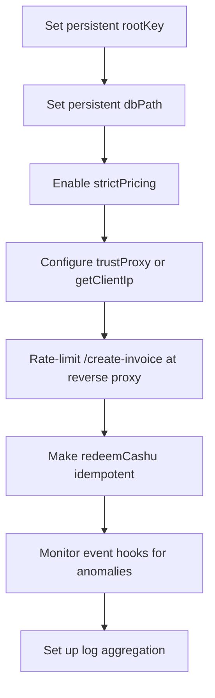

# Security Guide

toll-booth handles real money. This guide covers the security properties you get out of the box and the decisions you need to make as an operator.

## Threat model

toll-booth sits between untrusted clients and your upstream API. It must:

1. **Prevent access without payment** - no bypass of the 402 challenge
2. **Prevent replay of credentials** - a paid credential cannot be reused beyond its credit balance
3. **Prevent fund loss** - Cashu tokens must not be double-spent or lost in transit
4. **Protect client privacy** - no unnecessary PII collection or storage
5. **Resist abuse** - rate limiting, input validation, memory bounds

## Macaroon security

### Root key management

The `rootKey` is the master secret for all macaroon credentials. If compromised, an attacker can mint arbitrary macaroons with any credit balance.

```typescript
// Generate a root key
node -e "console.log(require('crypto').randomBytes(32).toString('hex'))"
```

**Production requirements:**
- **Always set a persistent `rootKey`** (64 hex chars / 32 bytes). Without it, a random key is generated per restart and all existing macaroons become invalid.
- Store the root key in a secrets manager or environment variable; never commit it to source control.
- Rotate the root key periodically. Rotation invalidates all outstanding macaroons, so coordinate with your users or rely on the credit system's natural expiry.

### Caveat validation

Macaroons support first-party caveats that restrict their use:

- **`payment_hash`**, **`credit_balance`**, **`currency`** - reserved caveats set by toll-booth; cannot be overridden via the API
- **`route`** - restricts the macaroon to a specific path prefix
- **`expires`** - Unix timestamp after which the macaroon is rejected
- **`ip`** - restricts usage to a specific client IP
- Custom caveats are forwarded as `X-Toll-Caveat-*` headers to the upstream

**Hardening measures:**
- Maximum 16 custom caveats per macaroon
- Maximum 1024 characters per caveat value
- Caveat keys are validated as alphanumeric only; special characters are rejected
- Caveat values are stripped of newlines to prevent header injection
- Duplicate custom caveats are rejected

### Preimage verification

The L402 credential (`Authorization: L402 <macaroon>:<preimage>`) is verified by:

1. Deserialising and signature-checking the macaroon against the root key
2. Extracting the `payment_hash` caveat
3. Verifying that `SHA256(preimage) === payment_hash`
4. Checking the credit balance has sufficient funds

The preimage is the proof of payment; without it, a macaroon alone grants no access.

## Payment security

### Lightning settlement

Invoice payment is verified via the Lightning backend's `checkInvoice()` method. toll-booth credits the account only after the backend confirms payment. The preimage returned by the Lightning network serves as cryptographic proof.

### Cashu redemption

Cashu ecash payments use a lease-based crash recovery system:

1. **Claim phase** - the payment hash is claimed with a lease (default 60 seconds). The claim is atomic; concurrent requests for the same payment hash are rejected.
2. **Redemption phase** - the operator's `redeemCashu` callback verifies and redeems the token with the Cashu mint.
3. **Settlement phase** - on success, credits are granted and the claim is settled. On failure, the lease expires and the claim becomes available for recovery.
4. **Recovery** - on startup, `recoverPendingClaims()` retries any claims that were leased but never settled (crash between claim and settlement).

**Operator responsibility:** Your `redeemCashu` callback must be idempotent for the same `paymentHash`. If the process crashes after redeeming with the mint but before settling in toll-booth, recovery will call your callback again.

### Settlement secrets

Settlement secrets (used for Cashu auth tokens) are generated as 64-character hex strings (32 bytes of entropy from `crypto.randomBytes`), not UUIDs. Status tokens use timing-safe comparison to prevent timing attacks.

## Input validation

### Request validation

- Authorization header format is strictly validated (`L402 <base64>:<hex64>`)
- Payment hashes are validated as 64-character hex strings
- Invoice amounts are validated as positive integers within safe bounds
- BOLT-11 strings, NWC URIs, and Cashu tokens have length limits enforced
- `X-Toll-Cost` header (variable metering) uses strict integer validation; scientific notation and floating point are rejected

### IP validation

- IP addresses from `X-Forwarded-For` are validated against IPv4/IPv6 format patterns
- Non-IP strings are rejected to prevent arbitrary values filling the tracking map
- Free-tier tracking is capped at 100,000 distinct IPs to prevent memory exhaustion
- IP addresses are one-way hashed with a daily-rotating salt before any in-memory storage

## Proxy security

### Header hygiene

Requests proxied to the upstream API have the following headers stripped:

- `Authorization` (L402 credential; not forwarded upstream)
- `Host` (replaced with upstream host)
- Hop-by-hop headers (`Connection`, `Keep-Alive`, `Proxy-Authenticate`, `Transfer-Encoding`, etc.)
- Any headers listed in the `Connection` header value

Responses from the upstream have hop-by-hop headers stripped before returning to the client.

### Cache control

All toll-booth responses include:

- `Cache-Control: no-store`
- `Pragma: no-cache`
- `X-Content-Type-Options: nosniff`

Payment page responses additionally include:

- `X-Frame-Options: DENY`
- `Referrer-Policy: no-referrer`
- `Permissions-Policy: camera=(), microphone=(), geolocation=()`

### SSRF protection

The upstream proxy rejects absolute-form request targets (e.g. `GET http://evil.com/`) to prevent SSRF via crafted request paths. Only relative paths are forwarded.

### Proxy trust

Enable `trustProxy: true` **only** when toll-booth runs behind a trusted reverse proxy that overwrites `X-Forwarded-For`. Without a trusted proxy, a client can spoof their IP to bypass per-IP free-tier limits.

For custom runtimes (Deno, Bun, Workers), use the `getClientIp` callback to extract the client IP from the runtime's connection info rather than relying on headers.

## Storage security

### SQLite

The default SQLite storage uses WAL mode for concurrent read performance. Three tables:

- **`credits`** - balance ledger (payment hash to credit balance)
- **`invoices`** - pending and settled invoices (pruned hourly by default)
- **`cashu_claims`** - Cashu redemption leases for crash recovery

Expired invoices are pruned automatically (default: older than 24 hours). Invoices with pending Cashu claims are protected from pruning.

### Database path

Use a persistent `dbPath` in production. The default (`./toll-booth.db`) may not survive container restarts. Mount a Docker volume or use an absolute path.

## Production checklist



1. **Set a persistent `rootKey`** - without it, macaroons are invalidated on restart
2. **Use a persistent `dbPath`** - credits and invoices survive restarts
3. **Enable `strictPricing: true`** - prevents unpriced routes from bypassing billing
4. **Configure proxy trust** - `trustProxy: true` behind a reverse proxy, or `getClientIp` for custom runtimes
5. **Rate-limit `/create-invoice`** at your reverse proxy - each call creates a real Lightning invoice
6. **Make `redeemCashu` idempotent** - crash recovery depends on it
7. **Monitor event hooks** - use `onPayment`, `onRequest`, and `onChallenge` for anomaly detection
8. **Aggregate logs** - payment and request events contain no PII but are valuable for debugging

## Reporting vulnerabilities

If you discover a security vulnerability, please report it privately via GitHub Security Advisories on the [toll-booth repository](https://github.com/forgesworn/toll-booth/security/advisories).
