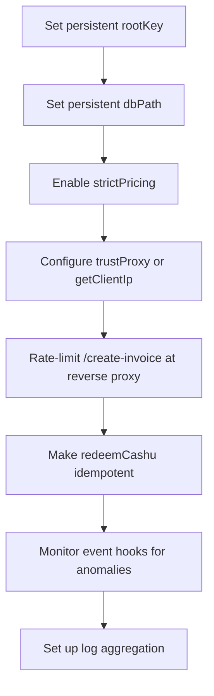

# Security Guide

toll-booth handles real money. This guide covers the security properties you get out of the box and the decisions you need to make as an operator.

## Threat model

toll-booth sits between untrusted clients and your upstream API. It must:

1. **Prevent access without payment** - no bypass of the 402 challenge
2. **Prevent replay of credentials** - a paid credential cannot be reused beyond its credit balance
3. **Prevent fund loss** - Cashu tokens must not be double-spent or lost in transit
4. **Protect client privacy** - no unnecessary PII collection or storage
5. **Resist abuse** - rate limiting, input validation, memory bounds

## Macaroon security

### Root key management

The `rootKey` is the master secret for all macaroon credentials. If compromised, an attacker can mint arbitrary macaroons with any credit balance.

```typescript
// Generate a root key
node -e "console.log(require('crypto').randomBytes(32).toString('hex'))"
```

**Production requirements:**
- **Always set a persistent `rootKey`** (64 hex chars / 32 bytes). Without it, a random key is generated per restart and all existing macaroons become invalid.
- Store the root key in a secrets manager or environment variable; never commit it to source control.
- Rotate the root key periodically. Rotation invalidates all outstanding macaroons, so coordinate with your users or rely on the credit system's natural expiry.

### Caveat validation

Macaroons support first-party caveats that restrict their use:

- **`payment_hash`**, **`credit_balance`**, **`currency`** - reserved caveats set by toll-booth; cannot be overridden via the API
- **`route`** - restricts the macaroon to a specific path prefix
- **`expires`** - Unix timestamp after which the macaroon is rejected
- **`ip`** - restricts usage to a specific client IP
- Custom caveats are forwarded as `X-Toll-Caveat-*` headers to the upstream

**Hardening measures:**
- Maximum 16 custom caveats per macaroon
- Maximum 1024 characters per caveat value
- Caveat keys are validated as alphanumeric only; special characters are rejected
- Caveat values are stripped of newlines to prevent header injection
- Duplicate custom caveats are rejected

### L402 credential verification

When a client sends `Authorization: L402 <macaroon>:<preimage>`, toll-booth runs a multi-stage verification pipeline before granting access. Every stage must pass; failure at any point returns a fresh 402 challenge.

#### Stage 1: Token parsing

The Authorization header is split at the last colon to extract the base64-encoded macaroon and the hex preimage:

```typescript
const auth = req.headers.authorization  // "L402 <base64>:<hex64>"
const token = auth.replace(/^L402\s+/i, '')
const lastColon = token.lastIndexOf(':')
const macaroonBase64 = token.slice(0, lastColon)
const preimage = token.slice(lastColon + 1)
```

#### Stage 2: Cryptographic signature verification

The macaroon is deserialised and its HMAC chain is verified against the server's `rootKey`. This confirms the macaroon was minted by this server and has not been tampered with. The `macaroon` library's `m.verify()` walks the caveat chain, checking each HMAC link.

During verification, toll-booth also **rejects duplicate caveats**. Macaroons allow anyone to append caveats (they can only narrow permissions, never widen them), but an attacker could append a duplicate `credit_balance` caveat hoping to override the server-set value. toll-booth tracks caveat keys during verification and rejects any key that appears more than once. Additionally, caveat parsing uses first-occurrence-wins semantics, so server-set caveats (which come first in the chain) always take precedence.

#### Stage 3: L402 identifier cross-check

The macaroon's binary identifier follows the Aperture-compatible version-0 layout:

| Bytes | Content |
|-------|---------|
| 0-1 | Version (uint16 big-endian, must be `0`) |
| 2-33 | Payment hash (32 bytes) |
| 34-65 | Random token ID (32 bytes) |

The payment hash is extracted from this identifier and cross-checked against the `payment_hash` caveat. Both are covered by the root signature, so a mismatch indicates tampering and fails verification.

#### Stage 4: Built-in caveat enforcement

If the macaroon contains built-in caveats, they are checked against the current request context:

| Caveat | Check | Example |
|--------|-------|---------|
| `route = /api/*` | Request path must match the pattern. Supports prefix matching with `/*` wildcard. | `route = /api/v1/*` allows `/api/v1/users` but not `/admin` |
| `expires = 2026-06-01T00:00:00Z` | Current time must be before the expiry timestamp. | Rejects expired macaroons |
| `ip = 203.0.113.1` | Client IP must match exactly. | Binds the macaroon to a specific client |

Any failing caveat check returns `{ valid: false }` immediately.

#### Stage 5: Preimage verification (proof of payment)

The preimage proves the client actually paid. toll-booth accepts two forms of proof:

**Lightning preimage:** The standard proof - `SHA256(preimage)` must equal the payment hash. Both values are compared using `crypto.timingSafeEqual` to prevent timing attacks:

```typescript
const computed = createHash('sha256').update(Buffer.from(preimage, 'hex')).digest()
timingSafeEqual(computed, Buffer.from(paymentHash, 'hex'))
```

**Cashu settlement secret:** For Cashu payments, the preimage is compared against the settlement secret stored during Cashu redemption. This also uses timing-safe comparison:

```typescript
timingSafeEqual(Buffer.from(preimage), Buffer.from(settlementSecret))
```

If neither check passes, authentication fails. A macaroon alone grants no access; the preimage is the proof of payment.

#### Stage 6: Credit settlement

On first valid presentation of a macaroon+preimage pair, toll-booth credits the balance to storage via `settleWithCredit()`. This is an atomic operation; if two concurrent requests race with the same credential, only one settles credits - the other continues with the existing balance. A random settlement secret is stored (not the raw preimage) to avoid leaking the bearer credential through the invoice-status endpoint.

#### Stage 7: Balance debit

After authentication, the engine debits the route's cost from the credit balance. If the balance is insufficient, the request falls through to a fresh 402 challenge. The remaining balance is returned to the client in the `X-Credit-Balance` response header.

```
Client sends: Authorization: L402 <macaroon>:<preimage>
                                    │              │
                            ┌───────┘              └────────┐
                            ▼                               ▼
                   Verify HMAC chain              Verify SHA256(preimage)
                   against rootKey                equals payment_hash
                            │                               │
                            ▼                               ▼
                   Check caveats                   Settle credits
                   (route, expires, ip)            (first time only)
                            │                               │
                            └───────────┬───────────────────┘
                                        ▼
                                  Debit route cost
                                        │
                                        ▼
                              Proxy to upstream API
```

This entire pipeline runs on every authenticated request. The cryptographic checks (HMAC verification, SHA256 preimage check) are the expensive part; caveat enforcement and balance debit are simple lookups.

## Payment security

### Lightning settlement

Invoice payment is verified via the Lightning backend's `checkInvoice()` method. toll-booth credits the account only after the backend confirms payment. The preimage returned by the Lightning network serves as cryptographic proof.

### Cashu redemption

Cashu ecash payments use a lease-based crash recovery system:

1. **Claim phase** - the payment hash is claimed with a lease (default 60 seconds). The claim is atomic; concurrent requests for the same payment hash are rejected.
2. **Redemption phase** - the operator's `redeemCashu` callback verifies and redeems the token with the Cashu mint.
3. **Settlement phase** - on success, credits are granted and the claim is settled. On failure, the lease expires and the claim becomes available for recovery.
4. **Recovery** - on startup, `recoverPendingClaims()` retries any claims that were leased but never settled (crash between claim and settlement).

**Operator responsibility:** Your `redeemCashu` callback must be idempotent for the same `paymentHash`. If the process crashes after redeeming with the mint but before settling in toll-booth, recovery will call your callback again.

### Settlement secrets

Settlement secrets (used for Cashu auth tokens) are generated as 64-character hex strings (32 bytes of entropy from `crypto.randomBytes`), not UUIDs. Status tokens use timing-safe comparison to prevent timing attacks.

### Payment rail binding (v5.0.0+)

Hardening applied to the stateless payment rails:

- **IETF Payment charge credentials are route- and amount-bound.** The HMAC challenge covers the resource path; a credential minted for one route is rejected at any other, and the engine refuses to settle a payment whose amount is below the route's price.
- **IETF session top-ups are single-use.** Each top-up payment hash is consumed atomically with the credit write in a single storage transaction, so a paid top-up cannot be replayed for additional credit.
- **Currency mismatches fail closed.** If a route has no price in the authenticating rail's currency, the request is challenged rather than proxied. An x402 (USD) credential on a sats-only route no longer resolves to a zero cost.
- **x402 payments are checked against the advertised requirements.** Network, asset, payTo and amount are validated before and after facilitator verification, from the same requirements object used to issue the challenge.

## Input validation

### Request validation

- Authorization header format is strictly validated (`L402 <base64>:<hex64>`)
- Request paths are normalised once in the engine before pricing lookup (duplicate slashes collapsed, trailing slashes stripped), so `/api/joke/`, `/api//joke` and `/api/joke` are priced identically across all adapters. Pricing keys are normalised at startup and key collisions throw.
- Payment hashes are validated as 64-character hex strings
- Invoice amounts are validated as positive integers within safe bounds
- BOLT-11 strings, NWC URIs, and Cashu tokens have length limits enforced
- `X-Toll-Cost` header (variable metering) uses strict integer validation; scientific notation and floating point are rejected

### IP validation

- IP addresses from `X-Forwarded-For` are validated against IPv4/IPv6 format patterns
- Non-IP strings are rejected to prevent arbitrary values filling the tracking map
- Free-tier tracking is capped at 100,000 distinct IPs to prevent memory exhaustion
- IP addresses are one-way hashed with a daily-rotating salt before any in-memory storage

## Proxy security

### Header hygiene

Requests proxied to the upstream API have the following headers stripped:

- `Authorization` (L402 credential; not forwarded upstream)
- `Host` (replaced with upstream host)
- Hop-by-hop headers (`Connection`, `Keep-Alive`, `Proxy-Authenticate`, `Transfer-Encoding`, etc.)
- Any headers listed in the `Connection` header value

Responses from the upstream have hop-by-hop headers stripped before returning to the client.

### Cache control

All toll-booth responses include:

- `Cache-Control: no-store`
- `Pragma: no-cache`
- `X-Content-Type-Options: nosniff`

Payment page responses additionally include:

- `X-Frame-Options: DENY`
- `Referrer-Policy: no-referrer`
- `Permissions-Policy: camera=(), microphone=(), geolocation=()`

### SSRF protection

The upstream proxy rejects absolute-form request targets (e.g. `GET http://evil.com/`) to prevent SSRF via crafted request paths. Only relative paths are forwarded.

### Proxy trust

Enable `trustProxy: true` **only** when toll-booth runs behind a trusted reverse proxy that overwrites `X-Forwarded-For`. Without a trusted proxy, a client can spoof their IP to bypass per-IP free-tier limits.

For custom runtimes (Deno, Bun, Workers), use the `getClientIp` callback to extract the client IP from the runtime's connection info rather than relying on headers.

## Storage security

### SQLite

The default SQLite storage uses WAL mode for concurrent read performance. Three tables:

- **`credits`** - balance ledger (payment hash to credit balance)
- **`invoices`** - pending and settled invoices (pruned hourly by default)
- **`cashu_claims`** - Cashu redemption leases for crash recovery

Expired invoices are pruned automatically (default: older than 24 hours). Invoices with pending Cashu claims are protected from pruning.

### Database path

Use a persistent `dbPath` in production. The default (`./toll-booth.db`) may not survive container restarts. Mount a Docker volume or use an absolute path.

## Production checklist


```mermaid
flowchart TD
    A[Set persistent rootKey] --> B[Set persistent dbPath]
    B --> C[Enable strictPricing]
    C --> D[Configure trustProxy or getClientIp]
    D --> E[Rate-limit /create-invoice at reverse proxy]
    E --> F[Make redeemCashu idempotent]
    F --> G[Monitor event hooks for anomalies]
    G --> H[Set up log aggregation]
```

1. **Set a persistent `rootKey`** - without it, macaroons are invalidated on restart
2. **Use a persistent `dbPath`** - credits and invoices survive restarts
3. **Enable `strictPricing: true`** - prevents unpriced routes from bypassing billing
4. **Configure proxy trust** - `trustProxy: true` behind a reverse proxy, or `getClientIp` for custom runtimes
5. **Rate-limit `/create-invoice`** at your reverse proxy - each call creates a real Lightning invoice
6. **Make `redeemCashu` idempotent** - crash recovery depends on it
7. **Monitor event hooks** - use `onPayment`, `onRequest`, and `onChallenge` for anomaly detection
8. **Aggregate logs** - payment and request events contain no PII but are valuable for debugging

## Reporting vulnerabilities

If you discover a security vulnerability, please report it privately via GitHub Security Advisories on the [toll-booth repository](https://github.com/forgesworn/toll-booth/security/advisories).
